# SKU 作图逻辑说明

**适用读者：** 使用 SKU 作图功能的运营、设计、产品同学  
**涵盖功能：** 复刻、裂变、原创、爆款主图

---

## 1. 四个功能分别做什么

SKU 作图页有四个 Tab，看起来都要上传图片，但**改的内容和产出完全不同**：

| 功能 | 一句话 | 你得到什么 |
|------|--------|------------|
| **复刻** | 把参考标签的设计，搬到你的 SKU 罐体上 | 整瓶产品图（只换了标签） |
| **裂变** | 在同一设计风格下，换一套新排版 | 整瓶产品图（标签 layout 变了） |
| **原创** | 在罐体上重新设计一张标签 | 整瓶产品图（全新标签） |
| **爆款主图** | 参考爆款广告的结构，换成你的产品 | 一张电商生活方式主图 |

**记住两条底线：**

- 复刻 / 裂变 / 原创 → **罐体不动，只换标签**
- 爆款主图 → **整张广告重做，换掉里面的产品**

---

## 2. 整体怎么跑（五步）

不管哪个 Tab，背后都是同一条链路：

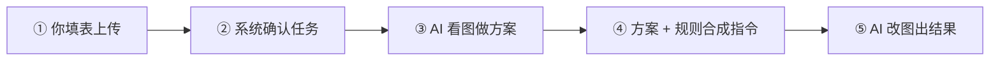

### 2.1 每一步在干什么

| 步骤 | 系统在做什么 | 你可以怎么理解 |
|------|-------------|----------------|
| ① 填表 | 收集图片、文案、张数 | 你告诉系统「用什么图、要什么效果」 |
| ② 确认任务 | 检查图片是否齐全、确定出几张 | 相当于下单前的校验 |
| ③ AI 看图 | 读你的图，规划标签/主图设计方案 | 像设计师先看稿再动笔 |
| ④ 合成指令 | 把「创意方案」和「硬性规则」合并 | 确保该锁的锁死、该改的改对 |
| ⑤ AI 改图 | 按指令在原图上编辑，逐张出图 | 最终渲染成图片 |

### 2.2 完整时序（从提交到出图）

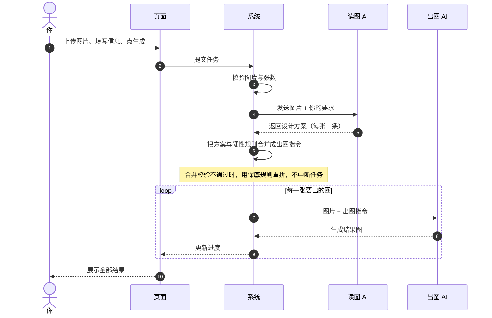

---

## 3. 你需要准备什么

### 3.1 标签三模式（复刻 / 裂变 / 原创）

| 填写项 | 复刻 | 裂变 | 原创 |
|--------|:----:|:----:|:----:|
| SKU 源图（你的瓶/罐产品图） | 必填 | 必填 | 必填 |
| 参考标签图 | **必填** | 可选 | 可选 |
| 品牌 / 产品名 / 容量 | 选填 | 选填 | 建议填产品名 |
| 附加要求 / 负向词 | 选填 | 选填 | 选填 |
| 出图张数 | 1 张或多张 | 同左 | 同左 |

**两张图各自代表什么：**

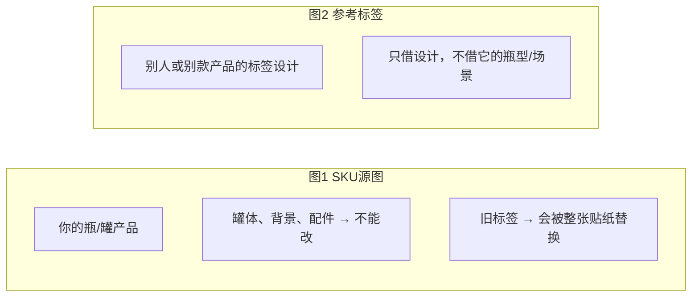

> 上传顺序不影响逻辑。系统出图时会统一约定：**源图在前、参考图在后**（有参考图时）。

### 3.2 爆款主图

| 填写项 | 要求 |
|--------|------|
| 爆款参考主图 | 必填 — 提供卖点、对比结构、广告氛围 |
| 新 SKU 产品图 | 必填 — 要换进去的产品 |
| 品牌 / 产品名 / 容量 | 选填；**没填时从 SKU 标签上读** |
| 出图张数 | 默认 3 张，可改 |
| 宽高比 | 默认 1:1 |

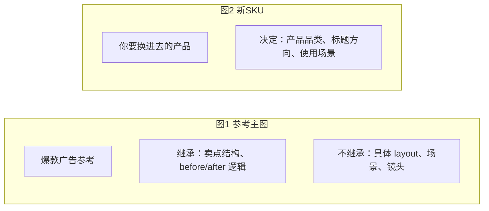

> 爆款主图出图时传图顺序与标签模式相反：**参考主图在前，SKU 在后**。

---

## 4. 标签三模式：逻辑详解

三种模式共用同一套「五步链路」，差异在于**参考图怎么用、旧标签怎么处理**。

### 4.1 共用规则（三种都一样）

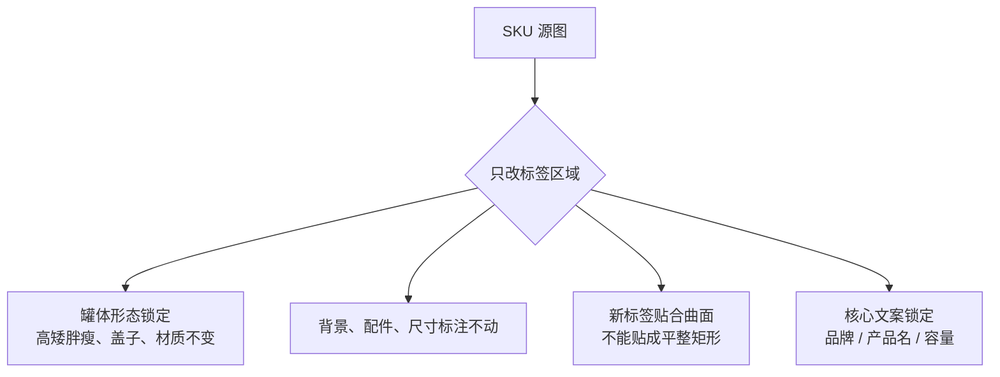

**文案从哪里来（优先级从高到低）：**

1. 你在表单里填写的
2. 有参考图时，从**参考标签**上读
3. 不从 SKU 源图旧标签上抄（避免把旧设计带回来）

**多张出图时：** 每一张的标签排版要有明显区别，不能只是换色。

### 4.2 复刻 — 把参考标签「搬」过来

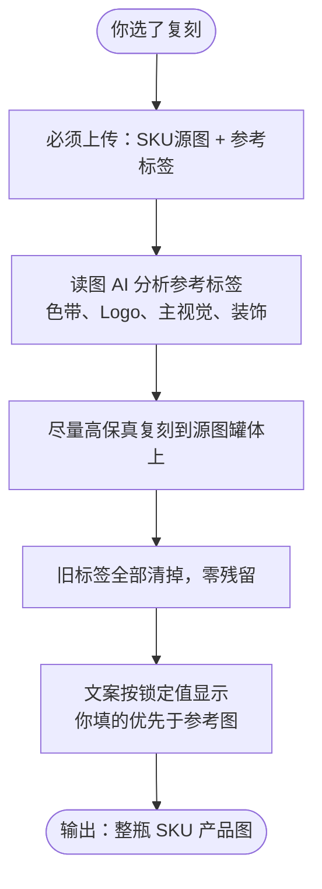

| 要点 | 说明 |
|------|------|
| 参考图角色 | **唯一视觉标准**，参考怎么设计就怎么贴 |
| 适合场景 | 已有满意标签设计，换到另一个 SKU 罐体上 |
| 不适合 | 想要完全不同的排版（应选裂变） |

### 4.3 裂变 — 同风格，换排版

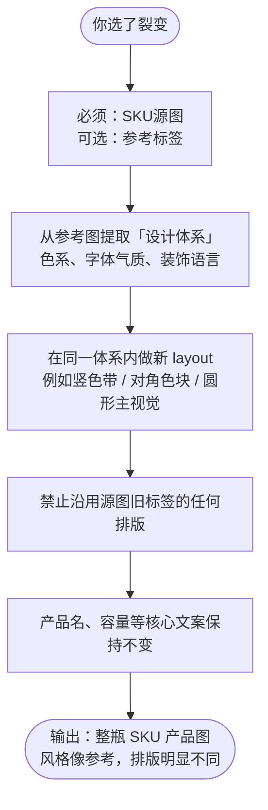

| 要点 | 说明 |
|------|------|
| 参考图角色 | 定「风格体系」，不是逐像素复制 |
| 适合场景 | 同一产品线要多款标签排版 |
| 多张出图 | 每张走不同 layout 轴线，缩略图一眼可区分 |

### 4.4 原创 — 在罐体上重新设计

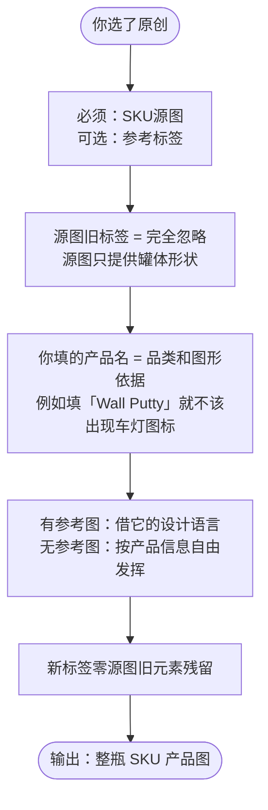

| 要点 | 说明 |
|------|------|
| 参考图角色 | 借设计灵感，不抄旧标签 layout |
| 适合场景 | 旧标签不满意，要全新设计 |
| 特别注意 | 务必填准确的产品名，它决定标签上的品类和图形 |

### 4.5 三模式一图对比

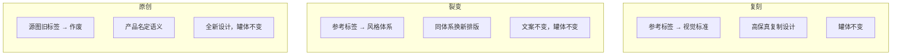

| | 复刻 | 裂变 | 原创 |
|--|------|------|------|
| 参考图 | 必传 | 可选 | 可选 |
| 旧标签 | 全部替换 | layout 不继承 | **完全作废** |
| 参考图作用 | 照着做 | 定风格，换排版 | 借语言，新设计 |
| 文案 | 你填 > 参考图 | 你填 > 参考图 | 你填 > 参考图 |
| 典型诉求 | 「把这个标签贴到这个瓶上」 | 「同风格给我几个不同版式」 | 「这个瓶重新设计标签」 |

---

## 5. 爆款主图：逻辑详解

### 5.1 和标签模式的本质区别

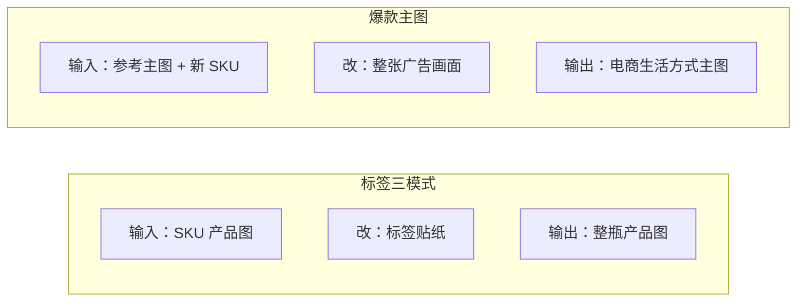

### 5.2 完整流程

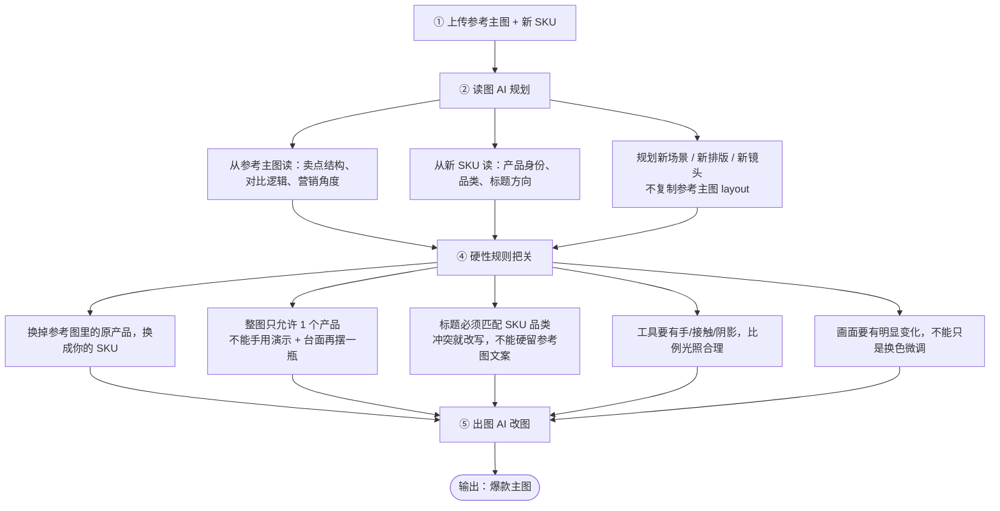

### 5.3 读图 AI 规划 vs 最终出图

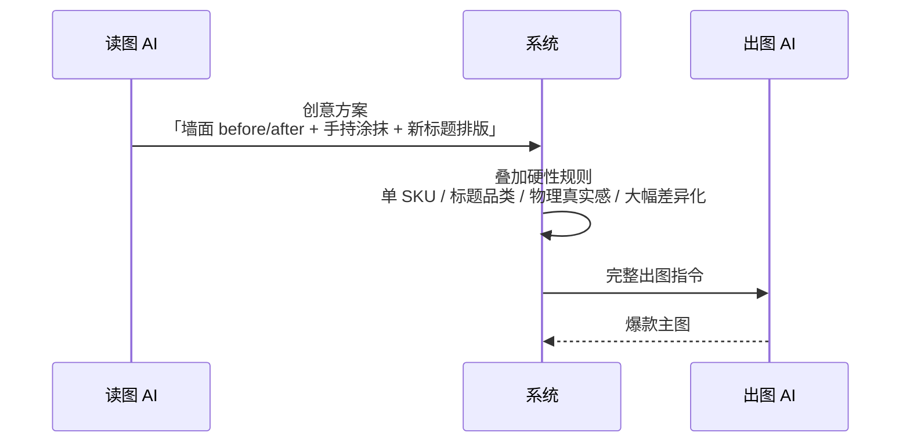

### 5.4 使用时注意

| 注意点 | 说明 |
|--------|------|
| 参考主图管什么 | 卖点结构、对比方式、整体营销角度 |
| 新 SKU 管什么 | 产品长什么样、什么品类、标题和场景怎么写 |
| 标题冲突 | 参考主图写「家电清洁」，SKU 是「墙面修补」→ 系统会改写标题 |
| 重复产品 | 不能同时出现「手里拿着产品在涂」和「台面上再摆一瓶」 |
| 未填文案 | 产品名/容量从 **SKU 标签** 读，不从参考主图读 |

---

## 6. 四个功能怎么选

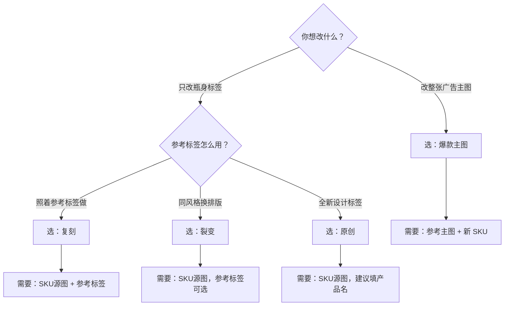

---

## 7. 四功能总对比

| | 复刻 | 裂变 | 原创 | 爆款主图 |
|--|------|------|------|----------|
| 改什么 | 标签 | 标签 | 标签 | **整张主图** |
| 必传图 | SKU + 参考标签 | SKU | SKU | 参考主图 + SKU |
| 罐体 | 不动 | 不动 | 不动 | 不适用（整图重做） |
| 参考图作用 | 视觉标准 | 风格体系 | 设计灵感 | 卖点结构 |
| 文案未填时 | 从参考标签读 | 同左 | 同左 | **从 SKU 标签读** |
| 产出 | 整瓶产品图 | 整瓶产品图 | 整瓶产品图 | 电商主图 |
| 多张差异 | 同参考下变层级 | 不同排版轴线 | 不同 layout | 不同场景/排版/镜头 |

---

## 8. 出多张图时

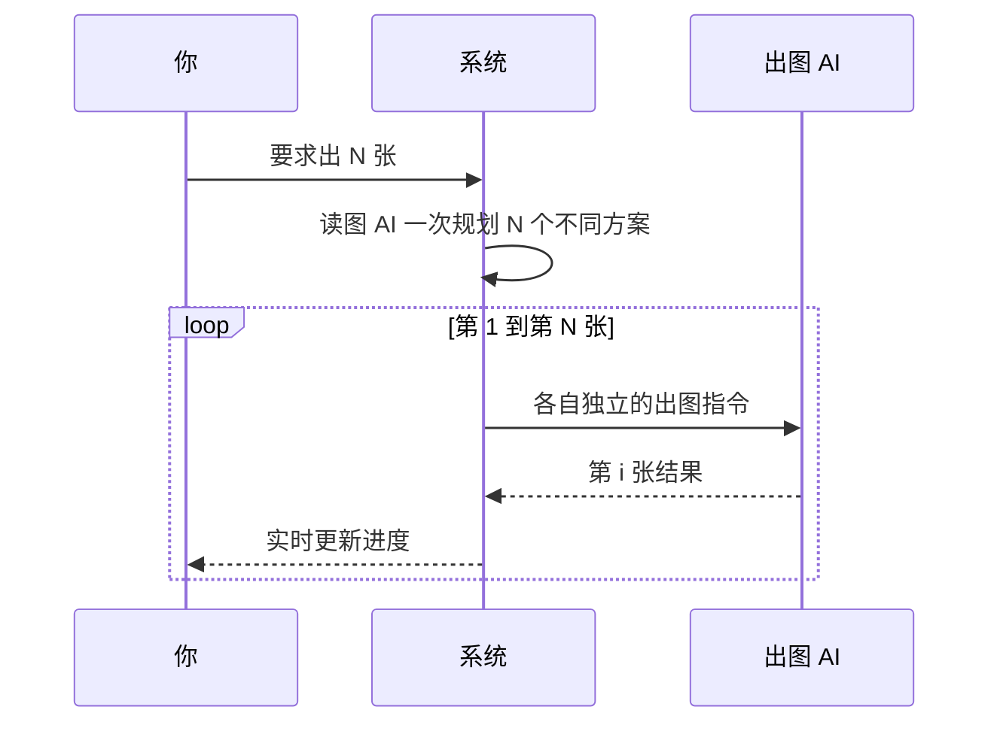

- **标签模式：** 每张标签排版要有明显区别，核心文案保持一致。
- **爆款主图：** 每张场景、排版、镜头要有明显区别，不能只是换色。

---

## 9. 出图注意事项

### 9.1 上传什么样的图更容易出好效果

| 图片 | 建议 | 避免 |
|------|------|------|
| **SKU 源图** | 瓶身完整、标签区域清晰、光线均匀、分辨率足够 | 严重模糊、强反光遮死标签、瓶体被裁切 |
| **参考标签** | 标签正面完整、文字可读、设计风格统一 | 只截局部、多产品混在一起、强透视变形 |
| **爆款参考主图** | 卖点结构清晰、before/after 逻辑明确 | 水印过多、主体被遮挡、多张拼贴难读 |
| **新 SKU（爆款主图）** | 产品正面清晰、标签文字能辨认 | 白底小图放大后标签糊掉 |

**尺寸图 / 包材渲染图也可以当 SKU 源图**，系统会尽量保留尺寸标注和空白罐体，只在可贴标区域设计标签。

### 9.2 填表建议

| 项目 | 建议 |
|------|------|
| **品牌 / 产品名 / 容量** | 能填尽量填；填了就不会被参考图或旧标签「带偏」 |
| **原创模式产品名** | **必填**，且要写准确——它决定标签上的品类和图形（填「墙面修补膏」就不该出现车灯类图标） |
| **出图张数** | 想要多款方案可选 3~5 张；只要一张确认效果选 1 张即可 |
| **附加提示词** | 写「希望怎样」，短句、具体，一次说 1~3 个重点 |
| **反向提示词** | 写「不要出现什么」，最多 500 字；适合列禁止元素 |

### 9.3 各模式特别注意

**复刻**
- 必须上传参考标签，且参考标签质量直接决定复刻上限
- 参考标签上的设计会尽量原样搬到你的罐体上；参考图本身模糊，结果也会糊
- 你填写的品牌 / 产品名 / 容量会覆盖参考标签上的对应文字

**裂变**
- 参考图可选；没有参考图时，差异化主要靠 AI 自由发挥，风格一致性会弱一些
- 多张出图时，系统会强制每张走不同排版轴线；若仍太像，可在附加提示词里要求「排版差异再大一点」

**原创**
- 源图旧标签会被完全忽略，但**产品名一定要填对**
- 有参考图时：借它的设计语言，不会抄源图旧 layout
- 没有参考图时：更依赖你填的产品信息和附加描述

**爆款主图**
- 必须同时有「参考主图 + 新 SKU」
- 参考主图提供卖点结构，**不是**让你复制它的具体画面
- 标题和场景以 **SKU 品类** 为准；与 SKU 冲突的参考图文案会被改写，这是正常行为
- 整图只应出现 **1 个产品**；不会出现「手里在用 + 台面上再摆一瓶」

### 9.4 附加提示词怎么用

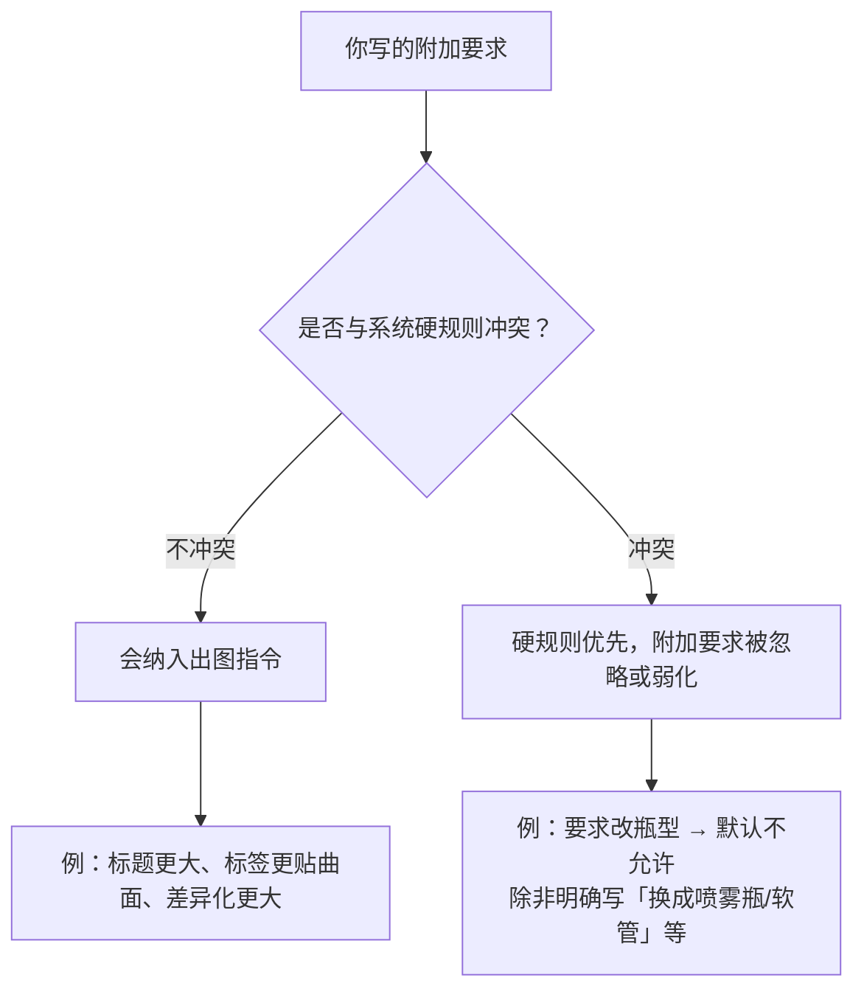

**有效写法：**
- 具体、可观察：`标签上下边缘跟随瓶身弧度，不要贴成平整矩形`
- 针对一个问题：`产品名加粗，容量放在底部色带内`
- 英文标题可直接写：`Headline: WALL MOLD REMOVER`

**不太有效的写法：**
- 空泛：`要好看一点`、`高级一点`（太主观，AI 难以执行）
- 一次塞太多矛盾要求：`完全复刻参考图，但 layout 完全不要像参考图`
- 试图绕过模式逻辑：`保留源图旧标签的排版`（裂变/原创/复刻均不允许）

### 9.5 反向提示词怎么用

反向提示词只表达**禁止项**，系统不会把它「反着做一遍」。

| 适合写 | 不适合写 |
|--------|----------|
| 不要假英文、不要医疗功效词 | 「要真实」这类正向需求（应放附加提示词） |
| 不要海绵、不要旁边道具 | 完整的设计方案描述 |
| 不要三图标卖点条、不要 hex 徽章 | 品牌名 / 产品名（应填表单字段） |

### 9.6 系统做不到的事

- 标签三模式**默认不改瓶型**（矮罐不会变高罐、瓶不会变管）
- 不能指望「完全像素级还原参考图」——AI 改图有随机性，同一参数多次结果也会不同
- 爆款主图不会保留与 SKU 品类冲突的参考图标题
- 附加提示词**不能覆盖**罐体锁定、文案锁定、单 SKU 等底层规则

---

## 10. 效果不满意？推荐附加提示词

下面按**常见问题**给出可直接复制修改的写法。  
先试 **附加提示词**；若是「出现了不该有的元素」，再配合 **反向提示词**。

### 10.1 标签三模式 · 通用问题

| 不满意的现象 | 附加提示词（复制改） | 反向提示词（可选） |
|-------------|---------------------|-------------------|
| 标签像平整贴纸，不贴瓶身 | 标签必须跟随瓶身弧度和透视，上下边缘随曲面弯曲，高光阴影与瓶身一致 | 不要 flat rectangle label, no pasted sticker look |
| 罐体被拉长/压扁/换瓶型 | （一般无需附加）检查 SKU 源图是否清晰；若源图本身正常仍变形，附加：`严格保持源图瓶型、高矮比例和盖子形态不变` | 不要 stretch bottle, no taller jar, no shape change |
| 容量没显示或格式不对 | 在表单容量栏填写如 `100g`；附加：`标签上必须显示 NET: 100g，清晰可见` | 不要 omit capacity |
| 品牌 / 产品名被改词 | 在表单直接填写正确文案；附加：`品牌和产品名必须逐字一致，不要同义词替换` | — |
| 旧标签元素还在（色带、图标、layout） | `完全替换源图旧标签，不要保留任何旧色带、旧图标或旧排版` | 不要 source label layout, no old label bands |
| 多张图太像 | `这一批每张的标签排版必须有明显区别，不要只是换色` | 不要 recolor-only variant |
| 出现了三图标卖点条 | — | 不要 3-icon row, no hex badge selling points, no feature icon grid |
| 假英文 / 乱码文案 | `所有可见文案必须是自然、正确的美式电商英文` | 不要 fake english, no gibberish text, no meaningless words |
| 背景、配件、尺寸标注被改 | `除主 SKU 标签外，背景、配件、尺寸线和数字全部保持与源图一致` | 不要 move annotations, no crop change |

### 10.2 复刻 · 专属问题

| 不满意的现象 | 附加提示词 | 反向提示词（可选） |
|-------------|-----------|-------------------|
| 不像参考标签，只是「差不多风格」 | `严格复刻参考标签的色带结构、Logo 位置、主视觉和装饰语言，不要简化或现代 reinterpret` | 不要 approximate style, no simplified layout |
| 参考标签元素漏了 | `参考标签上的每一条色带、徽章区和主视觉都必须出现在新标签上` | — |
| 复刻时混进了源图旧图标 | `标签视觉 100% 来自参考图，源图旧标签的品类图标和色带一律不要出现` | 不要 source category icons |
| 想改参考标签上的某个字 | 在表单填写品牌/产品名/容量；附加：`仅替换文字为表单填写值，视觉 layout 仍按参考标签` | — |

### 10.3 裂变 · 专属问题

| 不满意的现象 | 附加提示词 | 反向提示词（可选） |
|-------------|-----------|-------------------|
| 和参考图/layout 太像 | `在参考设计体系内做明显不同的排版轴线，hero 图形位置和标题层级都要变` | 不要 copy reference layout |
| 和源图旧标签太像 | `不要沿用源图任何标签排版，包括旧色带位置和旧标题区` | 不要 source label structure |
| 风格不像参考体系 | `色系、字体气质和装饰语言必须跟参考标签同一体系，只是排版不同` | — |
| 核心文案被改了 | 在表单锁定产品名和容量；附加：`产品名和容量必须与表单完全一致，只改视觉排版` | — |

### 10.4 原创 · 专属问题

| 不满意的现象 | 附加提示词 | 反向提示词（可选） |
|-------------|-----------|-------------------|
| 还在用源图旧标签排版 | `忽略源图旧标签全部视觉，重新设计 layout，零旧元素残留` | 不要 preserve source label |
| 出现了与产品无关的图标（如车灯） | 检查产品名是否准确；附加：`标签图形必须符合「{你的产品名}」的品类，不要出现汽车/车灯/引擎类元素` | 不要 car, no headlight, no vehicle icons |
| 品牌被自动加上去了 | 不想显示品牌就不要填品牌栏；反向：`不要任何品牌 logo 或 wordmark` | 不要 brand logo |
| 没有参考图，风格太随机 | `高级电商标签风格，清晰层级，主标题居中，容量在底部色带，NET: 前缀` | 不要 cluttered layout |
| 有参考图但不像同一体系 | `从参考标签推导色系和装饰语言，但 layout 要全新，不要抄源图旧标签` | — |

### 10.5 爆款主图 · 专属问题

| 不满意的现象 | 附加提示词 | 反向提示词（可选） |
|-------------|-----------|-------------------|
| 标题还是参考图旧文案，和 SKU 品类不符 | `标题必须匹配 SKU 产品品类，按 SKU 标签重写 headline 和 subheadline` | 不要 keep conflicting headline |
| 画面里产品出现了两次 | `整图只允许一个 SKU：如果在手用演示，就不要在台面或右下角再摆一瓶` | 不要 duplicate product, no countertop bottle, no second copy |
| 场景和 SKU 品类不对（如墙面 SKU 却在擦家电） | `使用场景必须按 SKU 品类来，例如墙面修补膏就展示墙面裂缝/霉斑修复` | 不要 appliance scene for wall product |
| 工具和手看起来假、悬浮 | `所有工具必须有可见的手持或接触面，有合理阴影，不要悬浮` | 不要 floating tools, no hovering applicator |
| 前景 SKU 太大，比例失真 | `SKU 清晰可见但比例真实，不要 oversized hero jar` | 不要 oversized product |
| 画面和参考主图太像，差异化不够 | `场景构图、镜头角度、标题排版至少改 3 处，不要复制参考主图 layout` | 不要 copy reference composition |
| 参考主图 before/after 逻辑丢了 | `保留 before/after 对比营销结构，但对比区域形状和位置要重新设计` | — |
| 想指定英文标题 | `Headline: WALL BLACK SPOT REMOVER，Subheadline: For everyday tile and grout` | 不要 fake english |

### 10.6 重试建议（怎么试下一轮）

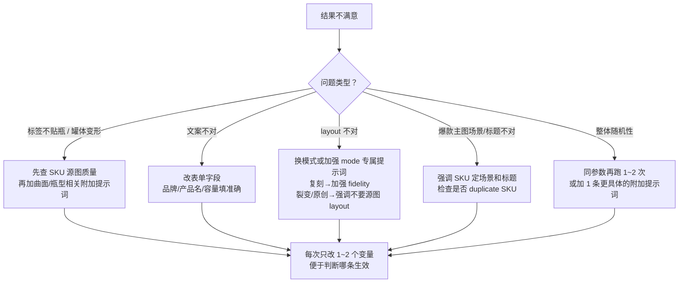

**实操建议：**
1. **先改表单，再改附加提示词**——品牌、产品名、容量填对了，往往比长段描述更有效。
2. **每次只加 1~2 条**，避免改太多导致新问题。
3. **反向提示词列 3~5 个禁止项**即可，不必写长段落。
4. 仍不满意时，保留**输入图 + 结果图 + 任务记录**，方便排查是源图问题还是提示词问题。

---

## 11. 常见问题

**Q：为什么我上传了两张图，但系统说图 1、图 2 和我上传顺序不一样？**  
A：系统按「角色」识别图片，不是按上传顺序。标签模式里源图=你的瓶，参考图=标签参考；爆款主图里参考主图在前、SKU 在后。

**Q：我填了产品名，还会被参考图覆盖吗？**  
A：不会。你填写的品牌、产品名、容量优先级最高。

**Q：没填产品名和容量会怎样？**  
A：标签三模式从参考标签读；爆款主图从新 SKU 标签读。都没有则可能留空，不会从 SKU 源图旧标签抄。

**Q：为什么标签看起来贴上去很「平」？**  
A：系统已要求标签贴合罐体曲面。若仍不满意，见 [§10.1 标签曲面问题](#101-标签三模式--通用问题) 的推荐附加提示词。

**Q：出图效果不满意怎么办？**  
A：先看 [§10 效果不满意？推荐附加提示词](#10-效果不满意推荐附加提示词)，按现象复制对应写法；每次只改 1~2 个变量再重跑。

**Q：爆款主图为什么标题和参考主图不一样？**  
A：当参考主图文案与 SKU 品类冲突时，系统会按 SKU 品类改写标题，避免「家电文案 + 墙面产品」这类矛盾。

**Q：任务失败了怎么办？**  
A：读图阶段失败通常需检查图片是否齐全；出图阶段失败可调整附加要求后重试。合并指令阶段失败时系统会自动用保底规则重拼，一般不影响出图。

---

## 12. 名词解释

| 名词 | 通俗解释 |
|------|----------|
| SKU 源图 | 你的瓶/罐产品照片，标签三模式里罐体不能改 |
| 参考标签 | 别人或别款产品的标签设计，只借设计不借瓶型 |
| 参考主图 | 爆款电商广告图，借卖点结构不借具体画面 |
| 文案锁定 | 品牌、产品名、容量一旦确定，出图必须按此显示 |
| 罐体锁定 | 瓶型、高矮、盖子、材质不能变 |
| 读图 AI | 先看图、做设计方案的 AI 步骤 |
| 出图 AI | 按指令在图片上编辑、生成最终结果的 AI 步骤 |
