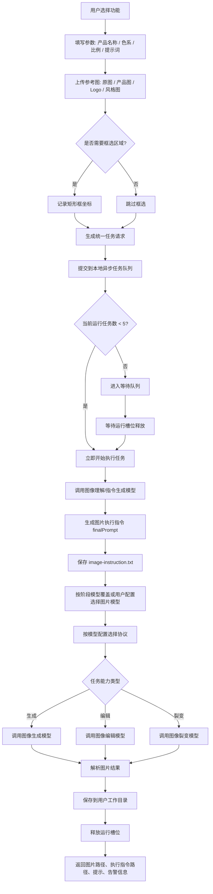
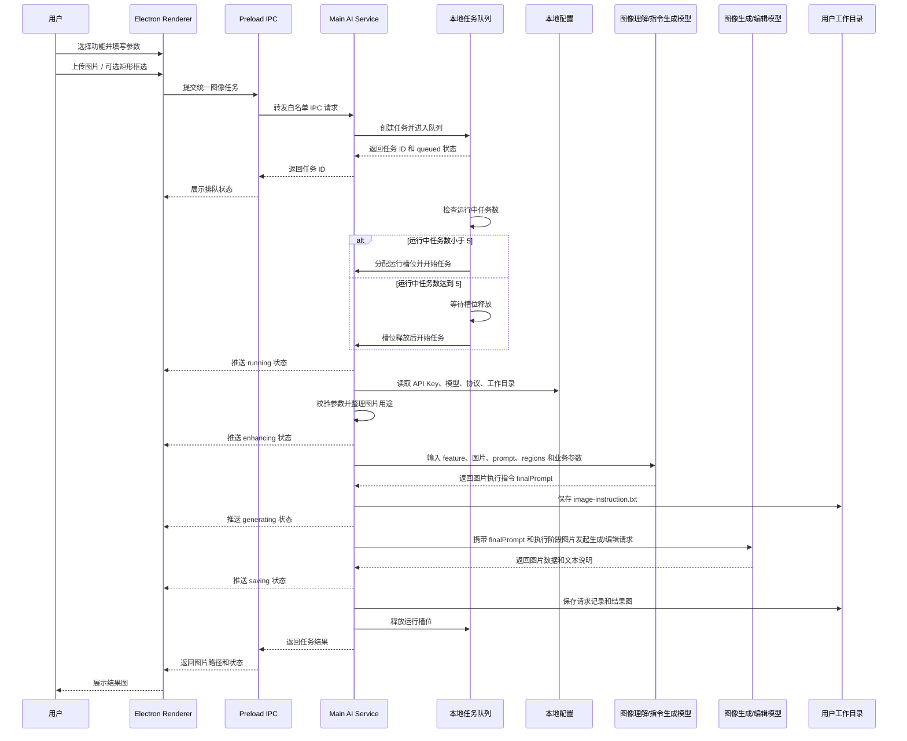
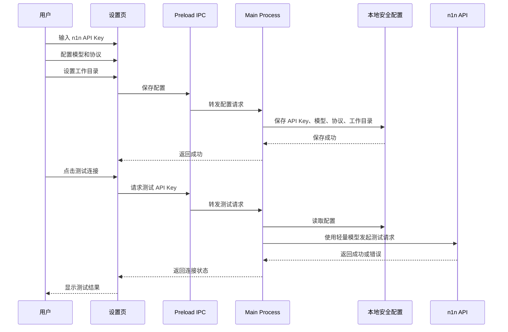

# AI 作图功能 API 实现方案

## 1. 总体架构

客户端由用户自行配置 n1n API Key、模型、协议和工作目录。模型不按功能写死默认值，而是基于用户配置的图像理解模型、图像生成模型和图像编辑模型选择；接口传入阶段模型时，可覆盖用户配置。

Electron 客户端采用三层结构：

| 层级 | 职责 |
|---|---|
| Renderer | 功能表单、图片上传、矩形框选、任务提交、任务状态、结果预览 |
| Preload IPC | 暴露受控 API，隔离 Renderer 和 Main |
| Main Process | 读取本地图片、组装请求、任务队列调度、图片执行指令生成、调用 n1n、保存结果、错误处理 |

API Key 不在 Renderer 业务代码中直接使用。用户填写的 n1n API Key 存在客户端本地安全配置中，由 Main Process 读取并调用接口。

所有图片生成、图片编辑和图片裂变任务都采用“两段式模型调用”：

1. 先调用图像理解/指令生成模型，把 `feature`、`source/reference` 图片、`prompt`、`regions`、`productName`、`logoText`、`colorScheme`、`aspectRatio`、阶段模型等结构化参数整理成图片执行指令 `finalPrompt`。
2. 再将 `finalPrompt` 和执行阶段需要的图片交给图片生成/编辑模型执行；必要的禁止事项应已经写入这条执行指令。

一阶段不要求模型输出 JSON，也不输出冗长分析报告，只输出可以直接交给第二阶段模型的执行指令文本。编辑类任务应简洁高效，默认 1-3 句；图像生成类任务可以添加更多视觉细节，用于补足主体、场景、构图、光影、风格、文字和比例等出图信息。

## 2. 客户端配置

客户端设置页需要支持以下配置：

| 配置项 | 说明 |
|---|---|
| n1n API Key | 用户自己的模型平台密钥 |
| Base URL | 默认 `https://api.n1n.ai` |
| 工作目录 | 生成结果保存位置 |
| 图像生成模型 | 用于无原图生成、场景生成、纯提示词素材生成 |
| 图像编辑模型 | 用于基于原图的编辑、替换、去除、裂变 |
| 图像理解/指令生成模型 | 用于所有任务前置的图片理解、参数合并和图片执行指令生成 |
| 模型协议映射 | 指定模型走 Gemini 协议或 OpenAI 协议 |
| 默认出图数量 | 由批次数控制，当前默认 4 |
| 最大同时运行任务数 | 当前固定为 5，可作为客户端配置项保留 |

模型配置应允许用户新增、修改和选择模型 ID。当前主要模型：

| 能力 | 模型 |
|---|---|
| 图片生成/编辑 | `gemini-3.1-flash-image-preview` |
| 图片生成/编辑 | `gemini-2.5-flash-image` |
| 图片生成/编辑 | `gpt-image-2` |
| 图片理解/指令生成 | `gemini-3.1-flash-lite` |
| 图片理解/指令生成 | `gpt-5.4-mini` |

## 3. 统一任务接口设计

业务层建议只暴露一个统一图像任务接口，由 `feature` 区分具体功能。

详细的功能枚举、请求字段、图片角色、区域结构和功能示例见 `docs/ai-image-feature-api.md`。

| 参数 | 必填 | 说明 |
|---|---:|---|
| feature | 是 | 功能类型 |
| modelOverrides | 否 | 阶段级模型覆盖；不传则使用用户配置模型 |
| prompt | 否 | 用户追加提示词 |
| images | 否 | 参考图、原图、产品图、Logo 图、风格图等 |
| regions | 否 | 可选矩形框选区域 |
| count | 否 | 单次任务出图数量，默认 1；需要多张时通过任务队列多次提交 |
| productName | 否 | 产品名称 |
| logoText | 否 | Logo 或品牌文字说明 |
| colorScheme | 否 | 自然语言色系 |
| aspectRatio | 否 | 图片比例，例如 `9:16`、`4:3`、`1:1` |

图片角色建议统一为：

| role | 含义 |
|---|---|
| source | 待处理原图 |
| reference | 效果或内容参考图 |
| style | 风格参考图 |
| product | 目标产品图 |
| logo | 目标 Logo 图 |

矩形框选只作为可选区域提示。

## 4. 功能 API 映射

| 功能 | 能力类型 | 输入重点 | 输出重点 |
|---|---|---|---|
| 贴纸复刻 | 图像编辑 | 包装/贴纸参考图、可选框选、产品名称、Logo、色系、比例 | 相似风格的 2D 平面贴纸 |
| 贴纸裂变 | 图像裂变 | 贴纸/包装参考图、裂变方向、色系、比例 | 多张不同排版/色系/风格贴纸 |
| 贴纸原创 | 图像生成 | 产品品类、产品名称、卖点、色系、可选参考图 | 原创 2D 平面贴纸初稿 |
| 去除产品 | 图像编辑 | 商品场景图、去除说明、可选框选 | 无产品场景素材 |
| 替换产品 | 图像编辑 | 场景图、目标产品图、替换说明、可选框选 | 替换为目标产品的场景图 |
| 替换 Logo | 图像编辑 | 原图、目标 Logo、替换说明、可选框选 | 替换 Logo 后的图片 |
| 主图素材裂变 | 图像裂变 | 主图/效果参考图、卖点、色系、对比形式 | 主图设计素材初稿 |
| 场景裂变 | 图像裂变 | 场景参考图、产品品类、场景方向、色系 | 多个具体使用场景素材 |
| 创作新场景图 | 图像生成 | 产品品类、场景描述、卖点、风格参考图 | 新电商场景图或场景素材 |
| 纯提示词主图/素材图 | 图像生成 | 用户提示词、可选参考图或风格图 | 主图设计素材或电商素材图 |

## 5. 模型选择规则

模型由能力阶段选择，不按具体功能维护默认模型表。

模型选择优先级：

1. 单次任务接口传入的阶段级模型覆盖。
2. 用户在客户端配置的阶段模型。

阶段模型配置：

| 阶段 | 使用模型配置 | 说明 |
|---|---|
| 图片执行指令生成 | 用户配置的图像理解/指令生成模型 | 所有任务都会先调用，用于理解输入并直接生成执行指令 `finalPrompt` |
| 图像生成 | 用户配置的图像生成模型 | 贴纸原创、创作新场景图、纯提示词主图/素材图 |
| 图像编辑 | 用户配置的图像编辑模型 | 贴纸复刻、贴纸裂变、去除产品、替换产品、替换 Logo、主图素材裂变、场景裂变 |

阶段级覆盖参数建议：

| 参数 | 说明 |
|---|---|
| modelOverrides.vision | 覆盖图像理解/指令生成模型 |
| modelOverrides.generation | 覆盖图像生成模型 |
| modelOverrides.edit | 覆盖图像编辑模型 |

能力路由：

| 功能 | 图像理解阶段 | 图片执行阶段 |
|---|---|---|
| 贴纸复刻 | 图像理解/指令生成模型 | 图像编辑模型 |
| 贴纸裂变 | 图像理解/指令生成模型 | 图像编辑模型 |
| 贴纸原创 | 图像理解/指令生成模型 | 图像生成模型 |
| 去除产品 | 图像理解/指令生成模型 | 图像编辑模型 |
| 替换产品 | 图像理解/指令生成模型 | 图像编辑模型 |
| 替换 Logo | 图像理解/指令生成模型 | 图像编辑模型 |
| 主图素材裂变 | 图像理解/指令生成模型 | 图像编辑模型 |
| 场景裂变 | 图像理解/指令生成模型 | 图像编辑模型 |
| 创作新场景图 | 图像理解/指令生成模型 | 图像生成模型 |
| 纯提示词主图/素材图 | 图像理解/指令生成模型 | 图像生成模型 |

## 6. 协议选择规则

模型协议由客户端配置维护，不在功能逻辑里写死。

| 协议 | 适用模型 |
|---|---|
| Gemini 协议 | Gemini 系列模型 |
| OpenAI 协议 | OpenAI 系列模型 |

调用前根据模型 ID 查询协议映射。如果用户传入模型但未配置协议，应提示用户先完成模型协议配置。

## 7. 强制图片执行指令生成流程

所有图片生成、图片编辑和图片裂变任务，都必须先经过图像理解/指令生成模型输出图片执行指令 `finalPrompt`，再调用图片模型。

图像理解/指令生成模型的职责不是直接出图，也不是输出 JSON，而是把用户输入、参考图、矩形框选和功能模板整理成可执行的图片执行指令。

一阶段输入来自统一任务参数，输出只需要执行指令文本。编辑类任务的指令应短、直接、低冗余，默认 1-3 句。图像生成类任务可以更详细，允许补充主体细节、场景氛围、构图、光影、材质、风格、文字规划和比例等信息。纯提示词主图/素材图允许用户输入图片，但这些图片只用于一阶段理解、提取风格、场景或构图方向，不传入第二阶段图片生成模型作为编辑图。

各功能增强重点：

| 功能 | 图片执行指令生成重点 |
|---|---|
| 贴纸复刻 | 分析贴纸区域、色系、排版结构、视觉层级、文字区域 |
| 贴纸裂变 | 分析原贴纸品类感、可变化区域、可裂变方向 |
| 贴纸原创 | 根据品类补充卖点、风格和标签结构 |
| 去除产品 | 识别产品主体、遮挡关系、背景补全方向 |
| 替换产品 | 分析原产品位置、姿态、透视、比例、光影和替换约束 |
| 替换 Logo | 分析 Logo 位置、材质、角度、透视和替换边界 |
| 主图素材裂变 | 分析卖点表达、Before/After 结构、局部细节和视觉焦点 |
| 场景裂变 | 根据品类和参考图发散具体使用场景 |
| 创作新场景图 | 根据品类、卖点和场景要求生成可控场景清单 |
| 纯提示词主图/素材图 | 将用户提示词和可选参考图整理为可执行的主图/素材生成指令，可补充必要视觉细节 |

一阶段指令生成模型接收的结构化输入示例：

```json
{
  "feature": "sticker_replica",
  "source": ["/authorized/input/package.png"],
  "reference": [],
  "prompt": "换成 wkau，容量写 6PIECES，整体更清爽",
  "regions": [
    {
      "id": "sticker-area",
      "x": 120,
      "y": 180,
      "width": 420,
      "height": 260
    }
  ],
  "productName": "",
  "logoText": "wkau",
  "colorScheme": "",
  "aspectRatio": "1:1",
  "model": "gemini-3.1-flash-lite"
}
```

一阶段输出示例：

```text
Create an independent 2D flat sticker design based on the sticker area in the source image. Keep a similar commercial label layout, clean visual hierarchy, and product-category feeling. Replace the brand text with wkau and include capacity text 6PIECES. Make the overall design cleaner and fresher. Output only the flat sticker artwork. Do not generate bottles, jars, boxes, packaging mockups, real product containers, or background scenes.
```

图片执行指令不直接展示给用户，作为图片模型的上游输入和本地排查产物保存。用户提示词与功能边界冲突时，执行指令必须保留功能边界并移除冲突要求。所有场景面向海外用户，输出图片中不得出现中文可见文字；中文参数在一阶段转换为英文 in-image copy。

## 8. 文件保存规则

所有结果保存到用户设置的工作目录。

建议目录结构：

```text
{workspaceDir}/outputs/{yyyyMMdd}/{taskId}/
  request.json
  image-instruction.txt
  result-1.png
  result-1.json
```

说明：

- `request.json` 保存原始请求摘要、图片角色、区域、模型覆盖和脱敏后的配置摘要。
- `image-instruction.txt` 保存一阶段生成的图片执行指令。
- 图片文件保存最终出图。
- 出图数量默认每次任务 1 张；需要批量结果时通过任务队列多次提交，而不是单次请求放大 `count`。
- 同名 `.json` 保存本次任务的输入、模型、用户原始提示词、图片执行指令、输出尺寸和脱敏后的模型响应摘要。
- 默认不额外保存未清洗的完整模型响应文件。
- 每个已完成任务通常对应 1 张输出图片及同名 `.json` 摘要。

## 9. 结果返回

任务结果返回给 Renderer 的内容：

| 字段 | 说明 |
|---|---|
| taskId | 本次任务 ID |
| feature | 功能类型 |
| model | 实际使用模型 |
| protocol | 实际使用协议 |
| outputDir | 结果保存目录 |
| images | 结果图片路径列表 |
| requestJsonPath | 请求摘要保存路径 |
| imageInstructionPath | 图片执行指令保存路径 |
| outputJsonPath | 同名输出 JSON 路径 |
| textNotes | 模型返回的文字说明 |
| warnings | 可展示给用户的警告 |

## 10. 异步任务队列机制

图像任务统一进入 Main Process 的本地任务队列，采用异步运行机制。

队列规则：

| 规则 | 说明 |
|---|---|
| 提交方式 | Renderer 提交任务后立即返回任务 ID |
| 执行方式 | Main Process 后台异步执行 |
| 最大并发 | 最多同时运行 5 个任务 |
| 超出并发 | 后续任务进入等待队列 |
| 状态推送 | 通过 IPC 向 Renderer 推送任务状态 |
| 结果保存 | 完成后保存到用户设置的工作目录 |
| 失败处理 | 单个任务失败不影响队列中其他任务 |
| 取消任务 | 等待中任务可直接取消；运行中任务尽量中断并标记取消 |

任务状态建议：

| 状态 | 说明 |
|---|---|
| queued | 已进入队列，等待执行 |
| running | 正在执行 |
| enhancing | 正在生成图片执行指令 |
| generating | 正在调用图片模型 |
| saving | 正在保存结果 |
| completed | 已完成 |
| failed | 已失败 |
| canceled | 已取消 |

## 11. 主流程图



## 12. 图像任务时序图



## 13. 配置时序图


