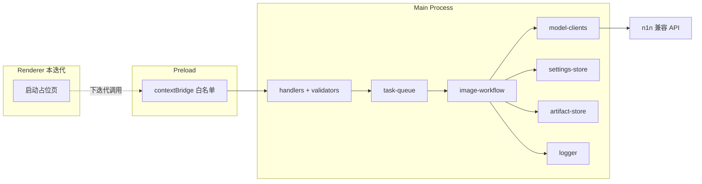

# Tickpic 全平台功能与基础框架设计

**日期：** 2026-06-02  
**状态：** 已批准（方案 A）  
**依据文档：** `docs/ai-image-api-implementation-plan.md`、`docs/ai-image-system-prompts.md`、`AGENTS.md`

## 1. 目标与范围

### 1.1 目标

将 Tickpic 从可行性验证脚本演进为符合文档的 **Electron 桌面应用基础框架**，并在 Main Process 实现 **全部 10 个 AI 作图功能模块**（两阶段工作流、统一任务 API、任务队列、产物保存、双协议模型客户端）。

### 1.2 本迭代交付

| 交付项 | 说明 |
|--------|------|
| electron-vite + React + TypeScript | 三进程工程可 `dev` / `build` |
| 安全 Electron 壳 | `contextIsolation`、`sandbox`、CSP、导航拦截 |
| Main 服务层 | 设置、队列、产物、日志、图像工作流、模型客户端 |
| 10 功能模块 | 统一 `feature` 路由与 `FeatureHandler` 注册表 |
| IPC + Preload 契约 | 完整白名单 API（Renderer 本迭代可不调用） |
| Renderer | **仅可启动窗口**（占位页，无业务 UI） |
| 测试 | 单元测试 + 集成测试（可 mock 模型） |

### 1.3 本迭代不做

- shadcn/ui、Tailwind 接入（已选型，下迭代实现）
- 功能表单、矩形框选、任务列表、结果预览等交互 UI
- electron-builder 分发、签名、公证、自动更新
- Worker 子进程（任务队列在 Main Process 执行）
- macOS Keychain 集成（设置先用加密本地文件，接口预留升级）

### 1.4 `scripts/` 定位（仅参考）

`scripts/` 目录下所有文件（含 `sticker-replica-demo.ts`、`gpt-image-demo.ts`、`scripts/lib/`）**仅作实现参考**，用于对照可行性验证时的调用方式与边界处理。

| 规则 | 说明 |
|------|------|
| 不依赖 | `src/` 生产代码 **不得** `import` 或运行时引用 `scripts/` |
| 不迁移 | 不把 `scripts/lib` 原样迁入或薄封装为 Main 模块 |
| 不扩展 | 不在 `scripts/` 继续堆叠或维护生产逻辑 |
| 唯一源码 | 全部生产实现写在 `src/`，以 `docs/` 与设计 spec 为准；可参考 `scripts/` 思路后**重新实现** |
| 验证方式 | 以 `tests/` 单元/集成测试及 Electron Main 路径为准；可选保留 `scripts/` 供开发者手动对照，但不纳入正式交付与 CI 必跑项 |

---

## 2. 技术选型

| 类别 | 选择 |
|------|------|
| 桌面框架 | Electron |
| 构建工具 | electron-vite |
| Renderer | React + TypeScript |
| UI（下迭代） | shadcn/ui + Tailwind CSS |
| 模型 SDK | `openai`、`@google/genai` |
| API 网关 | 用户配置的 n1n Base URL（默认 `https://api.n1n.ai`） |
| 入参校验 | Zod（`src/main/ipc/validators.ts` 与 shared schema） |
| 设置存储 | `app.getPath('userData')` 下加密 JSON 文件 |

---

## 3. 架构方案（方案 A）

**Main 优先 + 完整 IPC 契约 + 最小 Renderer。**



### 3.1 进程职责

| 进程 | 职责 |
|------|------|
| **Renderer** | 本迭代仅展示占位；下迭代负责表单、上传、框选、状态、预览 |
| **Preload** | `contextBridge` 暴露类型化 API；禁止暴露原始 `ipcRenderer` |
| **Main** | 配置、文件、队列、模型调用、产物写入、日志脱敏 |

### 3.2 统一任务流

所有图片任务经 **同一入口** `submitImageTask(request) → taskId`：

1. IPC 校验入参 → 入队（`queued`）
2. 并发槽位（最多 5）→ `running` → `enhancing`
3. 调用图像理解模型 → 解析结构化 JSON → 保存 `prompt-enhancement.json`
4. `generating`：按功能路由调用 generation 或 edit 模型
5. `saving`：写入 `request.json`、结果图、`warnings`
6. `completed` / `failed` / `canceled`

**禁止**绕过提示词增强阶段直接出图。

---

## 4. 目录结构

```text
src/
├── main/
│   ├── app/
│   │   ├── main.ts
│   │   ├── windows.ts
│   │   ├── menu.ts          # 可选最小菜单
│   │   └── navigation.ts    # CSP、will-navigate、外链策略
│   ├── ipc/
│   │   ├── channels.ts
│   │   ├── handlers.ts
│   │   └── validators.ts
│   └── services/
│       ├── settings-store.ts
│       ├── task-queue.ts
│       ├── artifact-store.ts
│       ├── logger.ts
│       ├── image-workflow/
│       │   ├── workflow-runner.ts
│       │   ├── feature-registry.ts
│       │   ├── handlers/           # 每功能一个 handler
│       │   ├── prompt-templates.ts
│       │   ├── image-io.ts
│       │   └── image-edit-prompt.ts
│       └── model-clients/
│           ├── resolver.ts
│           ├── openai-client.ts
│           └── gemini-client.ts
├── preload/
│   ├── index.ts
│   └── api.ts
├── renderer/
│   ├── index.html
│   ├── main.tsx
│   └── App.tsx
└── shared/
    ├── constants.ts
    ├── ipc-contracts.ts
    ├── schemas.ts
    ├── image-workflow-types.ts
    └── prompt-enhancement-schema.ts
```

`shared/` 仅放类型、常量、Zod schema；**可执行业务逻辑**只在 Main（及下迭代的 Renderer UI 代码）。

---

## 5. 统一任务 API

### 5.1 Feature 枚举

| `feature` 值 | 中文名 | 执行阶段模型 |
|--------------|--------|--------------|
| `sticker-replication` | 贴纸复刻 | edit |
| `sticker-variation` | 贴纸裂变 | edit |
| `original-sticker` | 贴纸原创 | generation |
| `remove-product` | 去除产品 | edit |
| `replace-product` | 替换产品 | edit |
| `replace-logo` | 替换 Logo | edit |
| `main-image-variation` | 主图素材裂变 | edit |
| `scene-variation` | 场景裂变 | edit |
| `create-scene` | 创作新场景图 | generation |
| `prompt-only-asset` | 纯提示词主图/素材图 | generation |

### 5.2 请求字段

| 字段 | 必填 | 说明 |
|------|:----:|------|
| `feature` | 是 | 功能类型 |
| `modelOverrides` | 否 | `vision` / `generation` / `edit` 阶段覆盖 |
| `prompt` | 否 | 用户追加提示词 |
| `images` | 视功能 | `{ role, path }[]`，role: source/reference/style/product/logo |
| `regions` | 否 | 矩形框选（相对坐标） |
| `count` | 否 | 出图数量，默认来自设置 |
| `productName` | 否 | 产品名称 |
| `logoText` | 否 | Logo/品牌文字 |
| `colorScheme` | 否 | 自然语言色系 |
| `aspectRatio` | 否 | 如 `9:16`、`1:1` |

路径类字段由 Main 校验：必须在用户授权的工作目录或对话框选择的文件范围内，防止路径穿越。

### 5.3 模型选择优先级

1. `modelOverrides.*`
2. 用户设置中的阶段默认模型
3. 无默认值时任务失败并提示配置

### 5.4 协议解析

- 用户维护 `modelId → gemini | openai` 映射
- `resolver` 在调用前解析协议；未配置则失败并提示
- 不在功能表硬编码模型 ID

---

## 6. 图像工作流

### 6.1 FeatureHandler 注册表

每个功能实现 `FeatureHandler` 接口：

```ts
interface FeatureHandler {
  feature: ImageFeature;
  validate(request: ImageTaskRequest): void;
  buildVisionMessages(request, enhancementContext): VisionMessageInput;
  buildImageExecution(request, enhancement: PromptEnhancement): ImageExecutionPlan;
}
```

共享编排位于 `workflow-runner.ts`：

- `runEnhancement()` → Vision 模型 + 功能/通用 system prompts
- `parseEnhancementJson()` → 校验 `prompt-enhancement-schema`
- `runImageExecution()` → 委托 resolver 选择 Gemini/OpenAI 客户端
- `persistArtifacts()` → `artifact-store`

### 6.2 提示词来源

- 通用与 JSON 增强：`docs/ai-image-system-prompts.md` 对应段落
- 各功能专属边界：同文档 §1–§10
- 系统提示词正文保持 **英文**
- `finalPrompt` 与 `negativeConstraints` 必须体现功能硬边界（如 2D 贴纸、不输出包装 mockup）

### 6.3 结构化 JSON

字段与文档一致：`feature`、`taskIntent`、`sourceImageUnderstanding`、`regionUnderstanding`、`subjectPlan`、`compositionPlan`、`stylePlan`、`textPlan`、`scenePlan`、`constraints`、`negativeConstraints`、`finalPrompt`、`modelHints` 等。

增强 JSON 默认不展示给用户，写入 `prompt-enhancement.json`。

### 6.4 与 `scripts/` 参考代码的关系

实现时可在 `src/` **对照** 下列参考文件的理解与 API 用法，但须按本 spec 与 `docs/` **独立编写**，不复制粘贴为生产依赖：

| 参考路径（只读） | 在 `src/` 中的对应实现 |
|------------------|------------------------|
| `scripts/lib/image-workflow/openai-workflow.ts` | `model-clients/` + `workflow-runner.ts` |
| `scripts/lib/image-workflow/prompt-templates.ts` | `prompt-templates.ts`（覆盖 10 功能） |
| `scripts/lib/image-workflow/image-io.ts` | `image-io.ts` |
| `scripts/lib/image-workflow/image-edit-prompt.ts` | `image-edit-prompt.ts` |
| `scripts/lib/model-clients/openai-config.ts` | `openai-client.ts` |
| `scripts/lib/shared/*` | `src/shared/*` |

若仓库中存在与 `scripts/lib` 重复的 `src/` 片段，实施时以 **`src/` 为唯一生产树** 整理合并，不保留对 `scripts/` 的引用。

---

## 7. Main 服务

### 7.1 settings-store

存储项：n1n API Key、Base URL、工作目录、图像理解/生成/编辑默认模型、模型协议映射表、`defaultCount`（默认 4）、`maxConcurrentTasks`（默认 5）、配置 schema 版本。

- API Key 加密写入，日志脱敏
- 读取失败或校验失败返回明确错误
- 提供 `testConnection()`：轻量模型 ping

### 7.2 task-queue

- 最大并发 5，超出进入 FIFO 等待
- 状态：`queued` | `running` | `enhancing` | `generating` | `saving` | `completed` | `failed` | `canceled`
- 等待任务可取消；运行中任务尽力中断（AbortSignal）并标记 `canceled`
- 单任务失败不影响其他任务
- 通过 `EventEmitter` 向 IPC 层推送状态（由 Preload 转发给 Renderer）

### 7.3 artifact-store

```text
{workspaceDir}/outputs/{yyyyMMdd}/{taskId}/
  request.json
  prompt-enhancement.json
  prompt.txt              # 可选：finalPrompt 明文副本
  result-1.png … result-N.png
  *.image-response.json   # 清洗后的模型响应摘要（无 base64）
```

### 7.4 logger

- 结构化字段：taskId、feature、stage、duration
- 禁止记录：完整 API Key、Authorization、base64 图片、未清洗原始响应

---

## 8. 模型客户端

### 8.1 接口

```ts
interface VisionClient {
  enhance(params: VisionEnhanceParams): Promise<string>; // JSON string
}
interface ImageClient {
  generate(params: ImageGenerateParams): Promise<ImageResult[]>;
  edit(params: ImageEditParams): Promise<ImageResult[]>;
}
```

### 8.2 实现

| 协议 | SDK | 用途 |
|------|-----|------|
| `openai` | `openai` | Vision（chat）、gpt-image 生成/编辑 |
| `gemini` | `@google/genai` | Gemini 图像理解与图像生成/编辑 |

Base URL 与 API Key 来自 `settings-store`，指向用户 n1n 配置。

### 8.3 GPT Image 尺寸

延续 `gpt-image-demo` 验证结论：编辑前读取 PNG 尺寸，映射到 API 支持的 `size` 枚举。

---

## 9. IPC 契约

### 9.1 Invoke 通道

| Channel | 请求 | 响应 |
|---------|------|------|
| `settings:get` | — | `AppSettings`（Key 脱敏） |
| `settings:save` | `AppSettings` | `{ ok: true }` |
| `settings:test-connection` | — | `{ ok, message? }` |
| `image-task:submit` | `ImageTaskRequest` | `{ taskId }` |
| `image-task:cancel` | `{ taskId }` | `{ ok }` |
| `image-task:get-status` | `{ taskId }` | `TaskStatusSnapshot` |
| `dialog:open-files` | `OpenFilesOptions` | `{ paths: string[] }` |

### 9.2 事件通道

| Channel | 载荷 |
|---------|------|
| `image-task:status` | `{ taskId, status, progress?, error?, outputDir? }` |

Preload 暴露：

```ts
subscribeTaskStatus(callback): () => void  // 返回取消订阅函数
```

禁止使用 `ipcRenderer.sendSync()`。

---

## 10. Electron 安全

遵循 `AGENTS.md` 与 `electron-development` skill：

```ts
webPreferences: {
  contextIsolation: true,
  nodeIntegration: false,
  sandbox: true,
}
```

- `windows.ts` 集中创建 `BrowserWindow`
- `navigation.ts`：严格 CSP、`will-navigate` 拦截、禁止意外新窗口
- `shell.openExternal` 仅允许 HTTPS 白名单
- Renderer 不接触 API Key 与 `fs` 任意路径写入

---

## 11. Renderer（本迭代）

- `App.tsx`：显示应用名与「Tickpic 已启动」类占位文案
- 不安装 Tailwind / shadcn
- Preload API 已就绪，供下迭代直接 `window.tickpic.*` 调用

---

## 12. 测试策略

| 类型 | 范围 |
|------|------|
| **Unit** | prompt 模板拼装、JSON schema 解析、feature 路由、validator、edit prompt 构建 |
| **Integration** | mock Vision/Image 客户端跑通队列与产物目录；贴纸复刻回归 |
| **Manual** | `npm run dev` 窗口启动；可选 `.env` 通过集成测试或后续 IPC 调试真机调用（不依赖 `scripts/`） |

CI 最低门槛：`npx tsc --noEmit`、`npm test`。

---

## 13. 实施顺序

1. 初始化 electron-vite（React + TS）与安全 `BrowserWindow`
2. `src/shared` 类型、常量、Zod schema
3. `settings-store`、`logger`
4. `model-clients` + `resolver`（OpenAI + Gemini）
5. `artifact-store`、`task-queue`
6. `image-workflow`：`workflow-runner` + 贴纸复刻 handler（实现后可对照 `scripts/` 做行为验证）
7. 其余 9 个 `FeatureHandler` + `prompt-templates`
8. IPC handlers + Preload API
9. 单元/集成测试（不依赖 `scripts/` 作为 CI 入口）
10. 更新 `AGENTS.md`：标明 `scripts/` 仅参考、`src/` 为正式入口与 `package.json` 的 `dev`/`build`/`test`

---

## 14. 下迭代衔接

- 接入 Tailwind + shadcn/ui
- Renderer：`settings`、`image-task`（按功能分路由）、`region-select`、`results`
- 订阅 `image-task:status` 驱动进度 UI
- 任务历史与结果预览

---

## 15. 决策记录

| 决策 | 选择 | 理由 |
|------|------|------|
| 总体方案 | A：Main 优先 | 与文档、安全边界一致；UI 下迭代只接 IPC |
| 构建栈 | electron-vite + React + TS | 用户指定 |
| UI 库 | shadcn（下迭代） | 用户指定，本迭代不接入 |
| Renderer 范围 | 仅启动窗口 | 用户指定 |
| 设置存储 | 加密 JSON | 实现简单，Keychain 可后换 |
| 功能组织 | FeatureHandler 注册表 | 10 功能可独立测试、边界清晰 |
| `scripts/` | 仅参考，不依赖 | 避免验证脚本与生产代码耦合；正式能力只在 `src/` |
