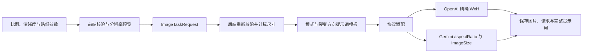

# 贴纸出图规格与提示词工程设计

**日期：** 2026-07-13
**状态：** 已完成方案讨论，等待书面设计复核
**范围：** Electron 桌面应用中的贴纸复刻、贴纸裂变、贴纸原创

## 1. 背景

当前三个贴纸功能已经具备参考图上传、结构化参数、比例选择、批量生成、任务恢复和 OpenAI/Gemini 协议调用，但输出规格与提示词存在以下问题：

- 图片比例和产品比例是两个互相竞争的参数，用户无法直观看到模型实际收到的像素尺寸。
- 任意比例在 OpenAI 路径中会退化为方图、横图、竖图三档，不能表达真实自定义比例。
- Gemini 路径只传比例，没有统一的 1K/2K 清晰度参数。
- 三个贴纸功能共享大量零散提示词，但复刻、裂变、原创的目标并不相同。
- 裂变被统一追加“必须明显改变版式、不能只换色”，与换色、背景重组、重点元素替换等方向直接冲突。
- 复刻同时存在“品牌”和“Logo 文字”，可能把两个不同值写进同一任务。
- 原创上传的风格参考图没有稳定地参与最终图片模型执行。

本次改造把输出尺寸、贴纸规范、模式差异和裂变方向收敛为一条可验证的数据链路，并保持其他图片功能不受影响。

## 2. 目标与非目标

### 2.1 目标

1. 三个贴纸功能统一支持预设比例和自定义比例。
2. 支持 1K、2K 两档清晰度，默认 1K。
3. 最长边固定为 1024 或 2048，另一边按比例换算并吸附到最近的 16 倍数。
4. 移除独立产品比例控件，把原产品比例并入图片比例预设。
5. 把用户提供的贴纸规范实现为三个模式共享、不可被低优先级内容覆盖的提示词契约。
6. 为复刻、裂变、原创分别定义目标、保留项、可变项和失败条件。
7. 为每一个裂变方向定义独立变化契约，消除通用提示词与方向提示词之间的冲突。
8. 任务请求、恢复、日志和产物记录完整保存比例、清晰度、目标分辨率和最终提示词。

### 2.2 非目标

- 不为所有模型维护动态能力数据库。
- 不改造贴纸以外的产品处理和主图功能。
- 不在模型返回错误尺寸时静默拉伸、裁切或重采样图片。
- 不把平面贴纸改造成瓶贴预览、包装 mockup 或 3D 渲染功能。

## 3. 输出规格模型

### 3.1 请求字段

贴纸任务保留 `aspectRatio`，新增：

```ts
type StickerOutputQuality = '1K' | '2K';

interface ImageTaskRequest {
  aspectRatio?: string;
  outputQuality?: StickerOutputQuality;
}
```

新任务不再提交 `productRatio`。读取旧任务时仍接受该字段，并迁移为 `aspectRatio`。

后端执行计划包含规范化后的输出信息：

```ts
interface ResolvedImageOutputSpec {
  aspectRatio: string;
  outputQuality: StickerOutputQuality;
  width: number;
  height: number;
  size: `${number}x${number}`;
}
```

前端预览和后端执行使用同一个纯函数换算规则；后端必须重新解析和验证，不能只信任渲染进程提交的显示值。

### 3.2 比例预设

统一的图片比例列表包括：

- 自动比例。
- 现有通用预设，如 `1:1`、`3:2`、`2:3`、`4:3`、`3:4`、`5:4`、`4:5`、`16:9`、`9:16`、`2:1`、`1:2`、`3:1`、`1:3`、`21:9`、`9:21`。
- 原产品比例预设：`21:5`（罐子）、`21:10`（高罐子）、`9:12`（瓶装）。
- 自定义比例入口，支持正整数或正小数，例如 `7:10`、`2.5:1`。

独立的“产品比例”控件、类型、尺寸映射和优先级逻辑将被删除。预设标签只用于帮助选择，不再形成第二套请求语义。

### 3.3 尺寸换算

清晰度基准：

| 清晰度 | 最长边 |
|---|---:|
| 1K | 1024 px |
| 2K | 2048 px |

换算算法：

1. 解析比例宽 `rw` 和比例高 `rh`，两者必须为有限正数。
2. 令 `longEdge` 为 1024 或 2048。
3. 较长轴固定为 `longEdge`。
4. 较短轴原始值为 `longEdge * min(rw, rh) / max(rw, rh)`。
5. 较短轴使用 `round(raw / 16) * 16` 吸附到最近的 16 倍数。
6. 如果吸附前或吸附后的短边不足 16 px，判定比例过于极端并拒绝提交。

示例：

| 比例 | 清晰度 | 分辨率 |
|---|---|---|
| `1:1` | 1K | `1024x1024` |
| `3:2` | 1K | `1024x688` |
| `9:12` | 1K | `768x1024` |
| `21:5` | 1K | `1024x240` |
| `3:2` | 2K | `2048x1360` |

`auto` 的解析规则：

- 复刻有框选区域时使用选区宽高比，否则使用当前源图宽高比。
- 裂变使用当前参考贴纸宽高比。
- 原创没有参考图时默认 `1:1`；有参考图时可选择自动采用参考图比例。
- 批量输入的每一张图片分别解析自动比例，不用第一张图片的比例覆盖整批。

### 3.4 协议映射

- OpenAI 兼容协议使用计算后的精确 `widthxheight` 作为 `size`。
- Gemini 协议传递规范化 `aspectRatio` 及对应的 `1K`/`2K` 图像尺寸参数。
- 协议适配器只负责字段映射，不重复比例算法。
- 具体 Gemini 配置结构以当前 SDK 和网关实际请求格式为准，并由协议测试锁定。

## 4. Electron 页面设计

### 4.1 基础参数

参考现有页面，基础参数保持三列：

1. 图片比例。
2. 清晰度，默认 1K，可切换 2K。
3. 生成数量。

比例下拉保留搜索和预设列表，并增加“自定义比例”。选择自定义后，在下拉中输入比例宽和比例高。控件下方实时显示最终像素，例如：

```text
3 : 2 · 1K → 1024 × 688 px
```

比例错误在控件内就地显示，提交按钮同步禁用，不使用生成后弹窗才告知的方式。

### 4.2 高级参数

三个模式统一使用清晰的结构化字段命名：品牌名称、产品名称、材料/素材、卖点、容量/规格、色系、风格、色块/版式要求和附加提示词。

复刻中的“品牌”和“Logo 文字”合并为唯一“品牌名称”，默认 `wkau`。Logo 图片继续作为可选品牌图形参考；品牌文字字段是最终可见品牌文案的唯一来源。

容量输入框下显示规范化预览：

```text
输入：100 ml
标签文案：NET: 100ML / 3.38 FL.OZ
```

可识别单位使用以下换算：

- `1 US FL.OZ = 29.5735 ML`
- `1 OZ = 28.3495 G`

如果用户已经提供两种单位，则保留明确提供的数值；如果容量不属于体积或重量，例如 `6 PIECES`，保留用户输入并使用规范英文格式，不强行换算为 ML 或 OZ。

## 5. 提示词工程架构

### 5.1 确定性构建

贴纸提示词使用专用构建器，不再依赖功能主提示词、通用结构化参数和零散英文后缀互相叠加。最终提示词按固定顺序生成：

1. 不可覆盖的贴纸输出契约。
2. 当前模式契约。
3. 当前裂变方向契约，仅裂变使用。
4. 已规范化的品牌、容量、产品名、卖点等结构化字段。
5. 参考图使用规则。
6. 用户附加要求。
7. 针对当前模式和方向的负面约束与验收检查。

优先级固定为：

```text
硬性贴纸规范
> 模式规则
> 结构化字段
> 参考图信息
> 用户附加提示词
```

低优先级内容与高优先级内容冲突时忽略冲突部分。最终发送给图片模型的提示词本身包含完整契约，不依赖后续 `finalize` 函数猜测是否缺少某一句。

### 5.2 共享硬规则

三个贴纸功能均必须遵守：

#### 输出形态

- 只输出一张正视、高完成度的二维平面标签贴纸。
- 贴纸占满画布并居中。
- 外轮廓为直角矩形，四角 90 度，边缘为水平或垂直直线。
- 不输出瓶、罐、盒、包装容器、使用场景、展示台、手持效果、额外背景、3D mockup 或拼贴。
- 不输出圆角、弧边、圆形、椭圆、异形、模切边或瓶身弧面轮廓。

#### 品牌与容量

- 品牌默认 `wkau`，用户可覆盖。
- 品牌文字使用纯白色，无渐变、描边、阴影、纹理或立体设计。
- 品牌右上角必须带注册标识 `®`。
- 品牌在贴纸内水平居中。
- 容量使用 `NET: XXXML / XX FL.OZ`、`NET: XXXG / XX OZ` 或规范化的其他英文规格。

#### 内容与排版

- 标题、品牌、卖点、副标题、净含量和装饰图形完整存在。
- 所有可见文字必须为英文；中文输入转换成自然、符合商品包装习惯的英文。
- 不允许错拼、乱码、随机字符、无意义伪文字、重复文本或遗漏核心文案。
- 根据英文长度调整字号、字距、行距和换行，保持美观、平衡、不拥挤。
- 主标题相对模型常规自动排版缩小约 20%，为其他信息留出空间。
- 整体内容视觉居中，文字整体向中间收拢。
- 左右安全边距加大，文字、Logo 和装饰不得贴边、裁切或模糊。

#### 质量

- 输出高清、清晰、边缘锐利，适合贴纸设计参考。
- 目标是商业完成度高的平面标签设计，不是产品效果图、瓶贴展示或包装渲染。

### 5.3 结构化字段优先级

- “品牌名称”是品牌可见文案的唯一真值来源。
- 规范化后的容量文案覆盖参考图中的旧容量。
- 用户填写的产品名、卖点和附加文案覆盖参考图中对应字段，但不能覆盖共享硬规则。
- 未被结构化字段覆盖的参考图文字，在复刻中尽量忠实保留并翻译为英文。
- Logo 图片只提供品牌图形识别，不作为版式、配色或风格参考；最终品牌仍服从纯白、居中和 `®` 规则。

最终完整提示词写入任务目录中的 `image-instruction.txt`，用于核查真实模型请求。

## 6. 三个功能的差异

| 功能 | 核心目标 | 必须保留 | 允许变化 | 失败条件 |
|---|---|---|---|---|
| 贴纸复刻 | 忠实还原原贴纸的平面设计 | 未被覆盖的文字、版式、色系、装饰、层级和位置 | 用户明确填写的品牌、容量、产品名、卖点、色系 | 擅自重设计、遗漏内容、仍带瓶身曲面、输出包装效果图 |
| 贴纸裂变 | 按指定方向生成同系列新款 | 品牌、`®`、容量格式、产品身份和用户锁定内容 | 当前裂变方向明确允许改变的维度 | 改错锁定字段、多个方向混杂、变化不足或破坏品牌一致性 |
| 贴纸原创 | 从产品信息建立全新标签 | 用户输入的品牌、产品名、容量和卖点 | 版式、图形、色系、装饰和视觉语言 | 照抄参考图、信息层级不完整、出现容器或场景 |

### 6.1 贴纸复刻

- 源图必填，可选贴纸区域和 Logo 图片。
- 对侧拍、斜拍、曲面或可见包装侧面的标签做去透视和曲面展开。
- 保留原图整体版式、色系、装饰、内容层级和图形位置。
- 只替换用户明确提供的品牌、容量、产品名、卖点或色系。
- 未明确要求改变的内容不得主动重设计。
- 图片执行使用高参考保真度。

### 6.2 贴纸裂变

- 源贴纸必填。
- 品牌、注册标识、容量、产品身份和用户明确锁定的字段始终保持。
- 可变范围完全由当前裂变方向决定，不再统一要求所有裂变都重做版式。
- 每次只使用一个主裂变方向，避免提示词同时要求保留和改变同一维度。
- 参考保真度根据裂变方向动态选择。

### 6.3 贴纸原创

- 产品类别、品牌或卖点至少提供一项。
- 根据结构化信息建立完整英文标签层级，不虚构认证、医疗功效或无法从输入支持的声明。
- 有参考图时只借鉴视觉语言，不照抄具体品牌、文字或版式。
- 原创参考图必须传给支持参考图输入的执行模型；它不能只停留在前端上传状态。
- 无参考图时使用纯生成路径；有参考图时使用相应协议的参考图生成/编辑路径，但输出目标仍是一张全新独立贴纸。

## 7. 裂变方向契约

每个裂变方向由以下字段描述：

```ts
interface StickerVariationStrategy {
  value: string;
  label: string;
  change: readonly string[];
  preserve: readonly string[];
  forbid: readonly string[];
  inputFidelity: 'low' | 'high';
}
```

### 7.1 智能裂变（不指定）

- 自动选择一个最适合源贴纸的主策略。
- 至少改变两个视觉维度，例如布局与背景，或色块结构与标题容器。
- 保留品牌、产品身份、容量和核心卖点。
- 禁止把多个不相关策略堆叠在一起，也禁止只做难以识别的微调。

自动选择的策略应写入提示词和任务记录，方便理解本次变化。

### 7.2 换品裂变

- 改变产品名、功效卖点、产品/功效图形及相应信息层级。
- 保留品牌视觉体系、注册标识和整体商业成熟度。
- 优先使用用户填写的目标产品信息；缺少目标字段时基于同品类生成合理系列产品，不引入不相关品类。
- 禁止继续展示原产品信息。
- 使用较低结构保真度，允许为新产品信息重新分配空间。

### 7.3 换色裂变

- 改变主色、辅助色、对比关系和色块配色。
- 保留原版式、文字内容、图形位置、品牌和容量。
- 禁止强行重排版式、只套单色滤镜或降低文字可读性。
- 使用高参考保真度。

### 7.4 反转裂变

- 改变明暗关系、主辅色地位以及上下或左右视觉重心。
- 保留核心内容、品牌和产品身份。
- 反转必须形成经过设计的视觉层级，不能做简单负片、镜像文字或破坏阅读顺序。
- 使用较低结构保真度。

### 7.5 色块/几何重组

- 改变贴纸内部几何色块、分区结构和装饰节奏。
- 保留文字内容、品牌、容量和主要信息层级。
- 内部可以使用适当几何图形，但贴纸外轮廓始终保持直角矩形。
- 禁止只移动一个小色块或改成异形贴纸。
- 使用较低结构保真度。

### 7.6 排版重组

- 改变标题、卖点、图形、徽章和容量的位置与层级。
- 保留文案内容、品牌、产品身份、主色基因和核心图形资产。
- 禁止只移动一两个小元素、遗漏文字或改变核心含义。
- 使用较低结构保真度。

### 7.7 背景重组

- 改变标签内部背景纹理、功能氛围、材质感和装饰底图。
- 保留前景文字结构、品牌、容量和核心产品信息。
- 只允许改变贴纸内部背景，不得增加贴纸外部场景、容器、展示台或 3D 背景。
- 使用高参考保真度。

### 7.8 爆款融合

- 提炼同品类成熟设计语言，重建更强的标题、卖点和视觉节奏。
- 保留当前品牌、产品信息和容量。
- 禁止引入第三方品牌、照抄其他标签或堆砌无关爆款元素。
- 使用较低结构保真度。

### 7.9 重点元素替换

- 只替换一个明确的大元素组，例如主标题容器、功效图、徽章或主插画。
- 保留其余版式、文字、品牌、色系和容量。
- 禁止同时改动多个区域或把局部替换做成整体重设计。
- 使用高参考保真度。

## 8. 数据流



任务恢复规则：

- 新任务恢复 `aspectRatio` 和 `outputQuality`。
- 缺少 `outputQuality` 的旧任务按 1K 恢复。
- 旧任务若 `aspectRatio` 为 `auto` 且包含 `productRatio`，将有效产品比例迁移为图片比例。
- 旧任务若已经有显式非自动 `aspectRatio`，该字段优先，不再应用旧产品比例。
- 恢复自定义比例时，比例控件显示自定义状态和计算后的分辨率。

## 9. 异常与结果校验

- 比例为空、格式错误、非有限数字或小于等于零：控件内提示并禁止提交。
- 极端比例导致短边不足 16 px：提示比例过大或过小。
- 品牌为空：使用默认 `wkau`。
- 容量无法识别：保留用户输入，提示无法自动生成标准双单位文案，不伪造换算结果。
- 模型或网关拒绝尺寸：错误信息包含协议、比例、清晰度和目标分辨率。
- 模型返回尺寸与请求不一致：任务可保留模型结果，但必须附带明确警告，并在日志记录目标与实际尺寸。
- 不对错误尺寸做静默拉伸或裁切，避免破坏贴纸版式和文字清晰度。

## 10. 测试与验收

### 10.1 纯函数测试

- 比例解析：整数、小数、空白、非法格式、零、负数、非有限值。
- 尺寸换算：`1:1`、`3:2`、`9:12`、`21:5`、自定义小数比例、1K 和 2K。
- 边界条件：短边恰好 16 px、吸附后为 16 px、短边不足 16 px。
- 容量规范化：ML/FL.OZ、G/OZ、双单位输入和非重量/体积规格。

### 10.2 提示词契约测试

- 三个模式都包含共享硬规则。
- 结构化品牌和容量覆盖参考图旧值。
- 用户附加提示词不能覆盖平面输出、英文文本、品牌样式和安全边距规则。
- 复刻包含忠实保留和去透视规则，但不包含裂变重构规则。
- 原创包含不照抄参考图规则，但不包含复刻忠实还原规则。
- 每个裂变方向分别验证 `change`、`preserve` 和 `forbid`。
- 换色方向不出现“必须重做版式”，排版方向不出现“必须保留原版式”等矛盾。
- 最终提示词不重复同一硬规则。

### 10.3 组件测试

- 基础参数显示图片比例、清晰度和生成数量，不再显示产品比例。
- 默认清晰度为 1K。
- 自定义比例输入实时显示正确像素。
- 非法比例显示就地错误并禁止生成。
- 复刻只有一个品牌文字字段，默认 `wkau`。
- 容量显示规范化预览。
- 三个模式提交正确的 `aspectRatio` 和 `outputQuality`。

### 10.4 恢复与协议测试

- 新任务完整恢复预设比例、自定义比例和清晰度。
- 旧 `productRatio` 自动迁移，显式 `aspectRatio` 保持优先。
- OpenAI 兼容协议收到精确 `widthxheight`。
- Gemini 协议收到比例和 1K/2K 参数。
- 裂变方向映射到正确参考保真度。
- 原创参考图实际进入支持参考输入的执行路径。

### 10.5 完整验证

1. 运行贴纸输出规格、提示词、组件、任务计划和协议相关测试。
2. 运行 TypeScript 类型检查。
3. 运行前端生产构建。
4. 运行 Electron 主进程与 preload 构建。
5. 使用代表性复刻、裂变和原创请求检查 `request.json` 与 `image-instruction.txt`。
6. 在可用模型配置下至少执行一个自定义比例 1K 冒烟任务，核对请求尺寸、实际图片尺寸和贴纸输出形态。

## 11. 完成标准

- 用户只需要设置一个图片比例，不再面对图片比例与产品比例冲突。
- 默认 1K，可切换 2K，所有计算尺寸的宽高都是 16 的倍数。
- `1:1 + 1K` 稳定得到目标尺寸 `1024x1024`。
- 预设和自定义比例在界面、请求、执行计划和协议载荷中保持一致。
- 三个贴纸功能使用同一硬规范，但模式目标不会互相污染。
- 每个裂变方向只改变其允许的维度，并明确锁定其他维度。
- 完整最终提示词可在任务产物中审计，且不再由互相矛盾的零散片段拼接而成。
- 相关测试、类型检查、前端构建和 Electron 构建通过；真实模型冒烟任务在具备有效凭据时完成。
