# 套图逻辑说明

**适用读者：** 使用套图处理功能的运营、设计、产品同学  
**涵盖功能：** 主图、对比图、多场景图

---

## 1. 三个功能分别做什么

套图处理页有三个 Tab，都从 **同一张 SKU 产品图** 出发，但产出用途不同：

| 功能 | 一句话 | 你得到什么 |
|------|--------|------------|
| **主图** | 根据 SKU 自动策划带英文标题的使用场景主图 | 电商主图（产品 + 场景 + 标题） |
| **对比图** | 展示使用前后的效果对比 | Before/After 对比图 |
| **多场景图** | 展示产品适用的多种痛点场景 | 适用范围信息图（通常不出现产品本体） |

**记住三条底线：**

- 三个 Tab 都**锁定 SKU 身份**——出现产品时，瓶型、标签、品牌不能变。
- 主图 / 对比图 → **必须有真实使用场景和痛点**，不是空泛棚拍。
- 多场景图 → **默认不露出产品**，只展示「能用在哪些地方、解决什么问题」。

---

## 2. 整体怎么跑（五步）

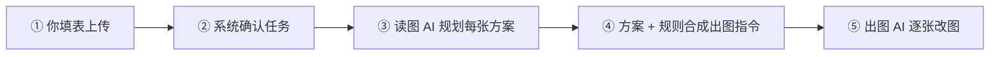

### 2.1 每一步在干什么

| 步骤 | 系统在做什么 | 你可以怎么理解 |
|------|-------------|----------------|
| ① 填表 | 上传 SKU、选 Tab、设参数 | 告诉系统「用什么产品、要什么类型的套图」 |
| ② 确认任务 | 校验 SKU 图、张数、宽高比 | 下单前检查 |
| ③ 读图 AI | 读 SKU 标签/包装，规划每张图的场景、构图、文案方向 | 像策划先出分镜脚本 |
| ④ 合成指令 | 把 AI 方案和你的控件（手持、布局、强度等）合并 | 确保 SKU 锁定 + 场景可信 |
| ⑤ 出图 AI | 按指令逐张生成 | 得到主图 / 对比图 / 多场景图 |

### 2.2 完整时序（从提交到出图）

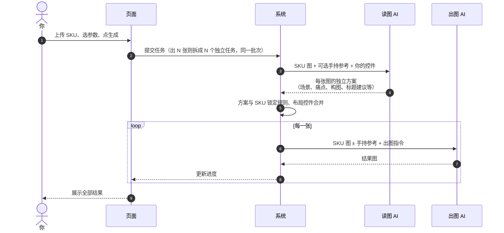

> 与 SKU 作图不同：套图**没有单独的「指令合并 AI」步骤**，读图 AI 的方案会直接与你的控件规则合成最终出图指令。

---

## 3. 你需要准备什么

### 3.1 共用填表项

| 填写项 | 说明 |
|--------|------|
| **SKU 产品图** | 必填；可上传多张（正面、侧面、标签细节），须为**同一 SKU** |
| **图片比例** | 默认 1:1，按平台需求选择 |
| **生成数量** | 主图/对比图默认 3 张，多场景默认 2 张 |
| **提示词** | 选填；补充场景、风格、构图、光线或文案 |
| **反向提示词** | 选填；列出不希望出现的元素（最多 500 字） |

### 3.2 各 Tab 专属控件

| 控件 | 主图 | 对比图 | 多场景图 |
|------|:----:|:------:|:--------:|
| 具体场景词 | ✅ | ✅ | ❌ |
| 手持方式 | ✅ | ❌ | ❌ |
| 具体效果 | ✅ | ❌ | ❌ |
| 手持参考图 | ✅（非「不手持」时可选） | ❌ | ❌ |
| 对比布局 | ❌ | ✅ | ❌ |
| After 产品展示 | ❌ | ✅ | ❌ |
| 对比效果程度 | ❌ | ✅ | ❌ |
| 画面模式 | ❌ | ❌ | ✅ |

**具体场景词：** 为空时 AI 根据 SKU 自动选场景；填写后优先朝你的方向策划（如「厨房台面油污」「汽车漆面虫胶」）。

---

## 4. 主图 · 逻辑详解

### 4.1 产出要求

每张主图应同时包含：

1. **SKU 产品**（清晰可读）
2. **英文大标题**（AI 根据场景自动生成，3~7 词左右）
3. **真实使用场景**（具体痛点表面 + 可见问题状态）

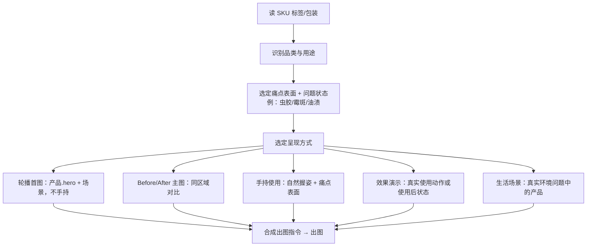

> 同一批次各张图的呈现方式**由 AI 自动搭配**，不是固定「第 1 张必手持、第 2 张必对比」。多张之间须在场景、构图、机位、产品位置等至少 3 项有明显差异。

### 4.2 手持方式

| 选项 | 含义 |
|------|------|
| **AI 自动判断** | 每张图由 AI 决定是否手持 |
| **手持展示** | 倾向出现自然握姿 |
| **不手持** | 产品作为场景 hero 摆放，不出现手 |

选手持时，可额外选**手持参考图**（按压泵、喷雾、软管、滴管等预设握姿），仅在 AI 判定该张需要手持时才会传给出图 AI。

### 4.3 具体效果

| 选项 | 含义 |
|------|------|
| **AI 自动判断** | 每张图由 AI 决定是否展示使用动作/效果 |
| **展示具体效果** | 展示真实品类对应的使用过程或使用后状态 |
| **不展示具体效果** | 只展示痛点环境，不出现喷射/涂抹等动作 |

**注意：** 只有真正的喷雾/泵头/扳机类产品才会出现喷射、雾气；非喷雾类 SKU **不会**被生成虚假喷嘴或喷雾。

### 4.4 主图流程图

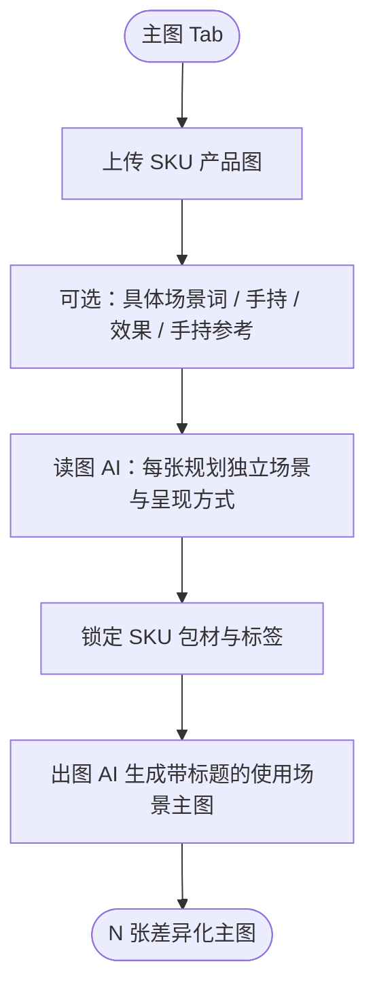

---

## 5. 对比图 · 逻辑详解

### 5.1 产出要求

- **每张图 = 一个场景的一组 Before/After**
- Before 侧：**不展示 SKU**，只展示使用前的问题状态
- After 侧：展示改善效果；是否同时展示 SKU 由你控制
- 必须有清晰英文 **BEFORE** / **AFTER** 标识

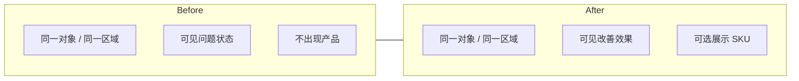

### 5.2 控件说明

| 控件 | 选项 | 说明 |
|------|------|------|
| **对比布局** | AI 自动 / 左右 / 上下 / 四宫格 / 六宫格 | 控制 Before/After 的排列方式 |
| **After 产品展示** | 展示产品 / 不展示产品 | After 区域是否出现 SKU |
| **对比效果程度** | 轻度 / 中度 / 重度 | 问题与改善的对比强弱 |
| **具体场景词** | 选填 | 指定对比发生在什么表面/环境 |

**四宫格 / 六宫格：** 每行仍是一组匹配的 Before（左）+ After（右），多行展示不同相关痛点区域。

### 5.3 对比图流程图

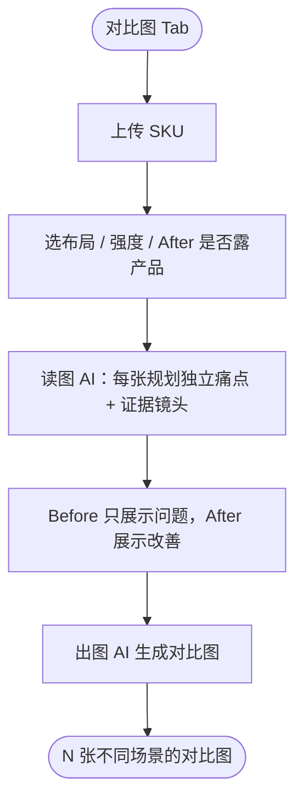

---

## 6. 多场景图 · 逻辑详解

### 6.1 产出要求

- 展示 SKU **适用的多种痛点场景**，帮助买家理解「能用在哪」
- **默认不出现**产品本体、包装、人物、手部
- SKU 图仅用于**识别品类和用途**，不要求产品在画面中露出
- 画面营销文字固定为**英文**

### 6.2 画面模式

| 模式 | 产出形态 |
|------|----------|
| **自动多样** | 批次内混合不同布局（宫格/拼图/单场景等） |
| **单场景** | 每张一个完整连续场景（唯一允许「单张实拍感」的模式） |
| **拼图** | 多格适用范围信息图，每格一种痛点 + 英文标签 |
| **宫格（自动变体）** | 多格信息图，宫格几何与标签样式在批次内变化 |

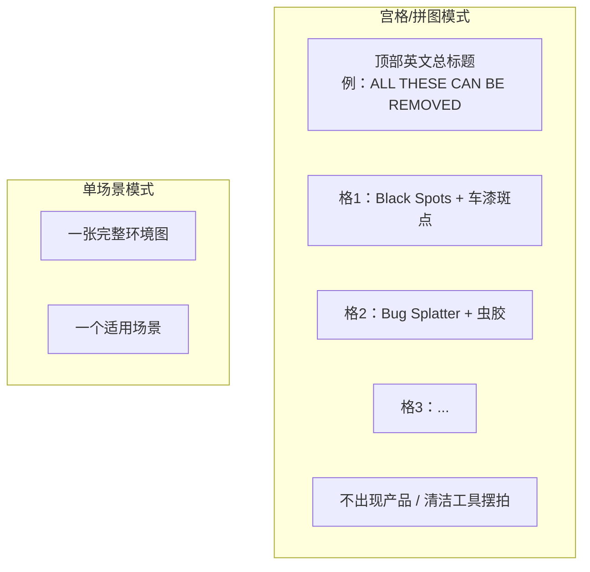

### 6.3 多场景图流程图

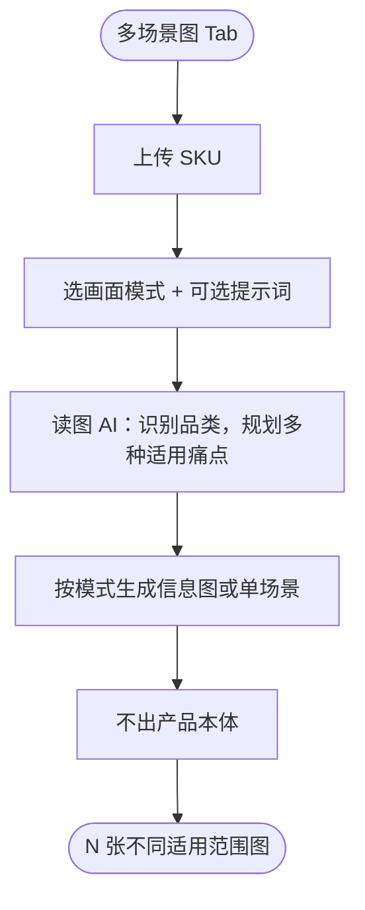

---

## 7. 三功能怎么选

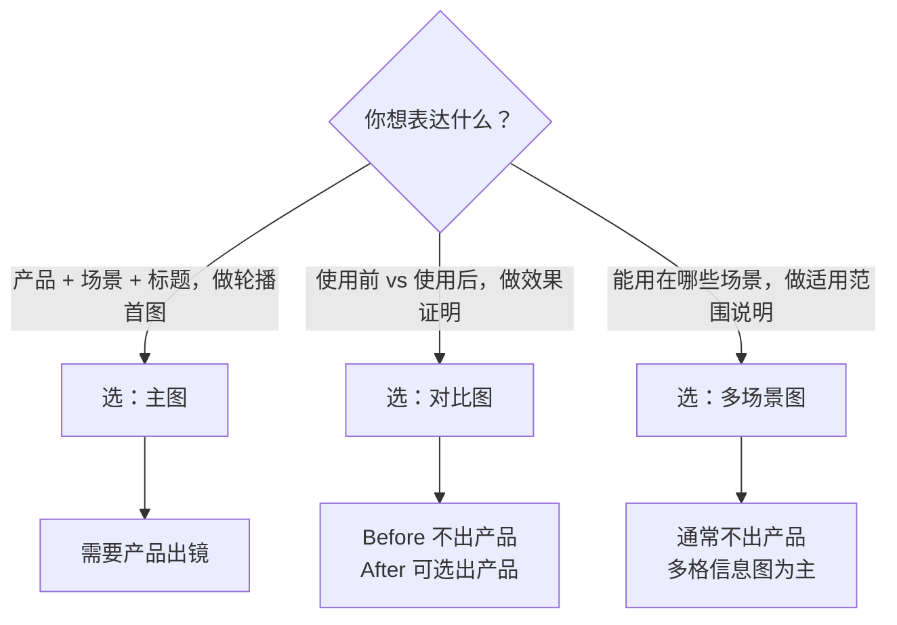

---

## 8. 三功能总对比

| | 主图 | 对比图 | 多场景图 |
|--|------|--------|----------|
| 核心用途 | 卖点 + 场景 + 标题 | 效果证明 | 适用范围 |
| SKU 是否出镜 | **必须** | Before 不出；After 可选 | **通常不出** |
| 英文标题 | AI 自动生成 | BEFORE / AFTER 标识 | 宫格/拼图有总标题 + 分格标签 |
| 具体场景词 | 支持 | 支持 | 不支持（用提示词补充） |
| 多张差异 | 场景/构图/呈现方式 | 不同痛点场景 | 不同适用场景/宫格样式 |
| 默认张数 | 3 | 3 | 2 |

---

## 9. 与 SKU 作图的区别

| | 套图处理 | SKU 作图 |
|--|----------|----------|
| 输入 | SKU 产品图（可多张同 SKU） | 源图 ± 参考图 |
| 改什么 | **生成新电商场景图** | 改标签或换整张爆款主图 |
| 产出 | 主图 / 对比图 / 多场景 | 整瓶产品图或爆款主图 |
| 标题 | 主图 AI 自动生成英文标题 | 标签/主图文案按规则锁定 |
| 典型场景 | 从 SKU 直接策划一组 listing 图 | 换标签设计或复刻爆款主图 |

---

## 10. 出多张图时

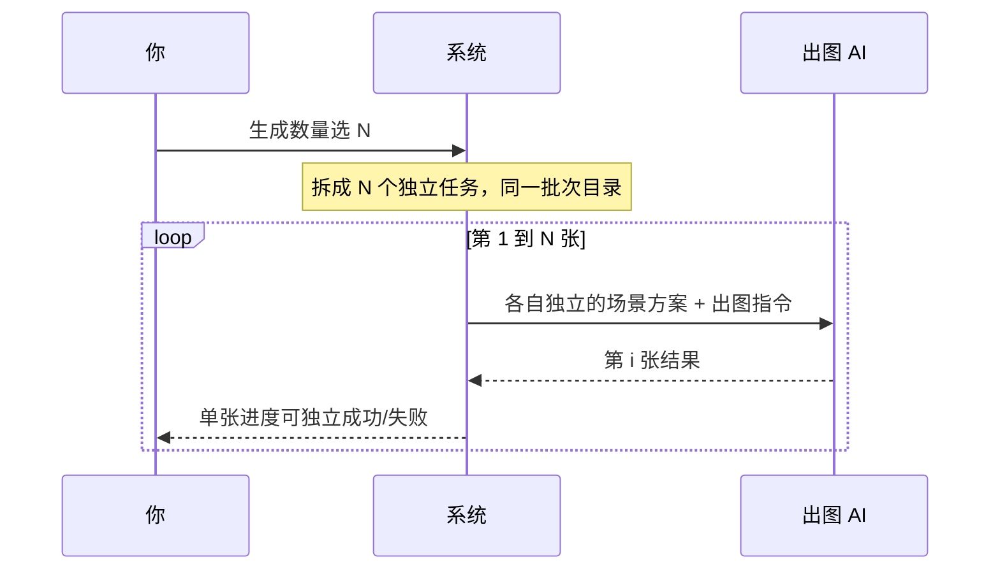

- 每张对应**独立进度**；部分失败时，已成功的结果会保留。
- 同一批次要求**明显不同**的场景/构图，不能只是换标题或换色。
- 「避免重复」是生成约束，**不是**绝对去重保证——极偶尔仍可能相近，可重跑或加提示词加强差异。

---

## 11. 出图注意事项

### 11.1 上传什么样的 SKU 图

| 建议 | 避免 |
|------|------|
| 正面清晰、标签可读 | 模糊、强反光遮死标签 |
| 多张同 SKU 不同角度（可选） | 混入不同产品的图 |
| 白底或棚拍均可 | 瓶体被严重裁切 |

系统会把多张 SKU 图视为**同一产品的不同视角**，综合识别品类与用途。

### 11.2 填表建议

| 项目 | 建议 |
|------|------|
| **具体场景词** | 想控场景就写具体表面/环境；不确定就留空让 AI 发挥 |
| **提示词** | 一次 1~3 个重点：构图、光线、标题风格 |
| **反向提示词** | 列禁止项：不要多余产品、不要假英文、不要清洁工具摆拍 |
| **主图手持参考** | 产品与参考握姿类型匹配时再选（喷雾配喷雾握姿等） |
| **对比图 After 产品** | 想强调品牌露出选「展示产品」；纯效果证明可选「不展示」 |
| **多场景画面模式** | 要适用范围信息图选宫格/拼图；要单张氛围图选单场景 |

### 11.3 系统做不到的事

- **不能一次上传多个不同 SKU** 分别生成
- **不能改 SKU 包材**（瓶型、标签、品牌、容量锁定）
- **非喷雾产品不会出现喷射/雾气**（即使提示词要求）
- **多场景宫格/拼图不会出现产品本体**（这是设计行为，不是 bug）
- **不能生成中文营销文字**（画面文案为英文）
- 不提供自动质量评分或「不满意自动重试」

### 11.4 附加提示词 vs 反向提示词

| | 附加提示词（提示词） | 反向提示词 |
|--|---------------------|------------|
| 写什么 | 希望怎样 | 不要出现什么 |
| 示例 | `厨房不锈钢台面油污场景，俯拍` | `不要 second bottle, no fake english` |
| 优先级 | 与 AI 方案合并；**不能突破 SKU 锁定** | 仅作禁止项 |

---

## 12. 效果不满意？推荐提示词

按现象复制修改。**提示词**写希望怎样；**反向提示词**写不要什么。

### 12.1 三 Tab 通用

| 不满意的现象 | 提示词 | 反向提示词（可选） |
|-------------|--------|-------------------|
| 场景与 SKU 品类不符 | `场景必须匹配 SKU 标签上的真实用途，不要臆造无关场景` | 不要 unrelated scene |
| SKU 变形 / 标签被改 | `严格保持 SKU 瓶型、标签、品牌与容量不变` | 不要 stretch bottle, no redesign packaging |
| 多张太像 | `与同批其他张在场景、机位、构图上至少 3 处明显不同` | 不要 recolor-only variant |
| 出现假英文 / 乱码 | `标题和标签必须是自然正确的美式电商英文` | 不要 fake english, no gibberish |
| 空泛棚拍 / 货架陈列 | `必须展示具体痛点表面和可见问题状态，不要空背景产品照` | 不要 studio shelf, no generic backdrop |

### 12.2 主图

| 不满意的现象 | 提示词 | 反向提示词（可选） |
|-------------|--------|-------------------|
| 标题太大/太小/看不清 | `英文标题清晰可读，不与产品重叠，3-7 词 benefit headline` | 不要 unreadable headline |
| 手看起来假 / 比例不对 | `自然真实的手部握姿，五指完整，产品与手比例合理` | 不要 giant hand, no floating hand |
| 非喷雾产品出现喷雾 | （一般无需写，系统已禁止） | 不要 spray mist, no fake nozzle |
| 想要手持但不出手 | 手持方式选「手持展示」+ 选手持参考图 | 不要 floating product |
| 不想要手持 | 手持方式选「不手持」 | 不要 hand, no holding |
| 想要 before/after 主图 | `Include clearly labeled BEFORE and AFTER of the same region with SKU visible` | — |
| 场景太乱 | `保持画面聚焦在产品、痛点表面和标题，减少无关道具` | 不要 clutter props |

### 12.3 对比图

| 不满意的现象 | 提示词 | 反向提示词（可选） |
|-------------|--------|-------------------|
| Before/After 不是同一区域 | `Before 和 After 必须是同一对象同一区域的 matched comparison` | 不要 different objects |
| Before 出现了产品 | `Before 侧只展示问题状态，不出现 SKU` | 不要 product in before panel |
| 对比不明显 | 对比效果程度选「重度」；附加：`对比差异清晰可见，问题与改善状态对比强烈` | — |
| After 缺产品 | After 产品展示选「展示产品」 | — |
| 布局不对 | 对比布局选「左右对比」或「上下对比」 | — |
| 多了毛巾/刷子等道具 | — | 不要 towel, no brush, no cleaning tools props |
| 四宫格内容重复 | `每一行展示不同相关痛点区域，不要重复同一污渍类型` | — |

### 12.4 多场景图

| 不满意的现象 | 提示词 | 反向提示词（可选） |
|-------------|--------|-------------------|
| 意外出现了产品 | `Do not render product body, packaging, or brand` | 不要 bottle, no product, no SKU |
| 出现了人物/手 | — | 不要 person, no hand |
| 想要宫格但出了单张实拍 | 画面模式选「宫格」或「拼图」 | 不要 single lifestyle photo |
| 想要单张氛围但出了宫格 | 画面模式选「单场景」 | 不要 multi-panel grid |
| 格子内容重复 | `Each panel must show a different applicable problem surface with unique English label` | — |
| 出现了清洁工具摆拍 | — | 不要 cleaning tools, no sponge, no brush arrangement |
| 想加总标题 | `Top headline: ALL THESE CAN BE REMOVED, bold English caps` | — |

### 12.5 重试建议

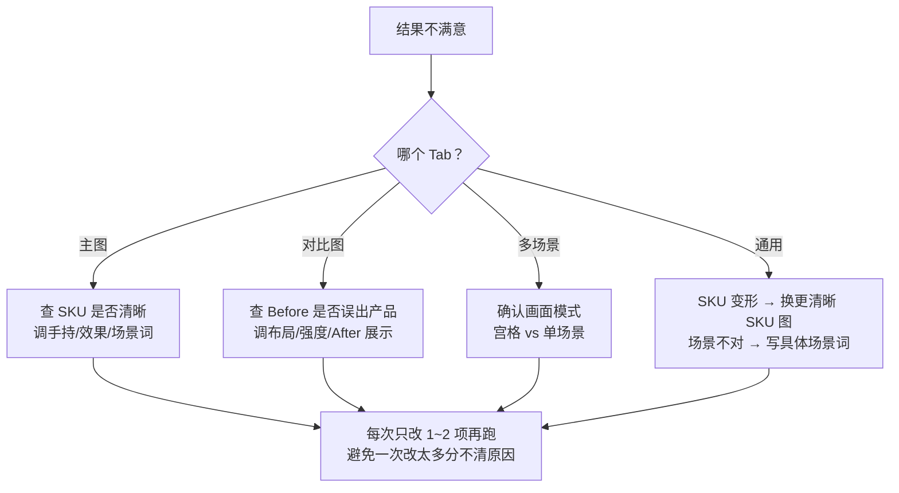

---

## 13. 常见问题

**Q：上传了多张 SKU 图，系统怎么用？**  
A：视为同一产品的不同角度/细节，综合识别品类与包材；出图时仍锁定为同一个 SKU。

**Q：主图为什么有的 handheld、有的不是？**  
A：读图 AI 会为每张选最合适的呈现方式。选手持方式「手持展示」会提高手持概率；选「不手持」则不会出现手。

**Q：对比图 Before 为什么没有产品？**  
A：这是设计行为——Before 只展示「问题状态」，让对比更聚焦；After 可按需展示产品。

**Q：多场景图为什么看不到我的产品？**  
A：多场景图目的是展示「适用范围」，不是产品展示图。需要产品出镜请用**主图** Tab。

**Q：非喷雾产品能出喷射效果吗？**  
A：不能。系统禁止为非喷雾类 SKU 生成喷雾、雾气或虚构喷嘴。

**Q：具体场景词和提示词有什么区别？**  
A：**具体场景词**（主图/对比图）专门约束「发生在什么环境/表面」；**提示词**可补充构图、光线、标题等更广泛要求。

**Q：批次里某一张失败了怎么办？**  
A：其余成功的图会保留；可对失败张单独调整提示词后重新生成整个批次，或接受已有结果。

**Q：和 SKU 作图的「爆款主图」有什么区别？**  
A：套图主图从 SKU **全新生成**场景；SKU 爆款主图需要**参考一张已有爆款广告**并替换其中的产品。两者入口不同、逻辑不同。

---

## 14. 名词解释

| 名词 | 通俗解释 |
|------|----------|
| SKU 产品图 | 你的瓶/罐/管产品照片，套图的起点 |
| 具体场景词 | 指定使用发生在什么环境或表面（如厨房台面、汽车漆面） |
| 痛点表面 | 产品实际作用的对象（如瓷砖缝、车漆、.fabric） |
| 问题状态 | 使用前的可见问题（如霉斑、油渍、虫胶） |
| 手持参考 | 预设的标准握姿图，仅在主图需要手持时使用 |
| Before/After | 使用前 vs 使用后的对比 |
| 适用范围信息图 | 多场景 Tab 的宫格/拼图，每格一种可解决的痛点 |
| 批次 | 同一次点击生成的一组图，共享任务目录 |

---

## 附录：相关文档

- [SKU 作图逻辑说明](./SKU作图逻辑说明.md) — SKU 复刻/裂变/原创/爆款主图
